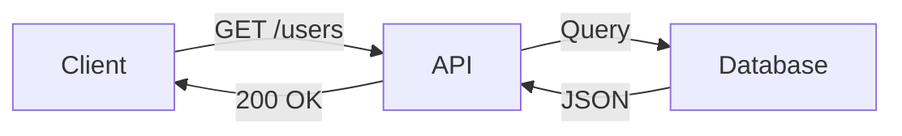
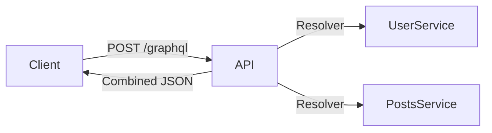
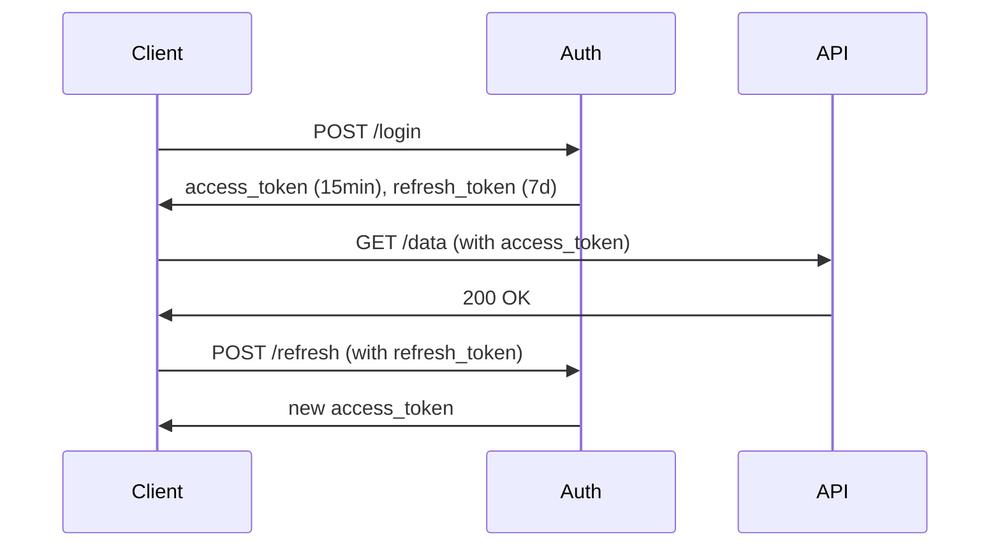

Modern APIs must handle thousands to millions of requests while maintaining performance, security, and developer experience. Let's examine proven patterns that scale.

## 1. REST vs GraphQL: Architectural Showdown

### REST (Representational State Transfer)

*Figure 1: Typical REST request flow*

---

#### Pros:

*   Cache-friendly (HTTP caching)
*   Simple to implement
*   Stateless by design

#### Cons:

*   Over-fetching/under-fetching
*   Multiple round trips for complex data

#### Example:

<pre class="cgr7g c2bb0 ca9r6 cx6ng c9xwx cme8e cmy5q"><code class="c4j9y">GET /api/v1/users/123
Accept: application/json
Authorization: Bearer xyz</code>
</pre>

### GraphQL

*Figure 2: GraphQL request flow*

---

#### Pros:

*   Single request for complex data
*   Strong typing with schema
*   Client-driven queries

#### Cons:

*   Caching complexity
*   N+1 query problems
*   Performance monitoring challenges

#### Example:

<pre class="cgr7g c2bb0 ca9r6 cx6ng c9xwx cme8e cmy5q"><code class="c4j9y">query {
  user(id: 123) {
    name
    posts(limit: 5) {
      title
      comments(limit: 3) {
        text
      }
    }
  }
}
</code></pre>

## 2. Rate Limiting: Protecting Your API

*Figure 3: Token bucket algorithm visualization*

---

The Token Bucket algorithm uses a bucket of tokens to limit and regulate the flow of requests.

### Implementation:

<pre class="cgr7g c2bb0 ca9r6 cx6ng c9xwx cme8e cmy5q"><code class="c4j9y">from fastapi import FastAPI, Request
from fastapi.responses import JSONResponse
from slowapi import Limiter, _rate_limit_exceeded_handler
from slowapi.util import get_remote_address
from slowapi.errors import RateLimitExceeded

app = FastAPI()

limiter = Limiter(key_func=get_remote_address)
app.state.limiter = limiter
app.add_exception_handler(RateLimitExceeded, _rate_limit_exceeded_handler)

@app.get("/api/data")
@limiter.limit("100/minute")
async def get_data(request: Request):
    return {"data": "rate limited API response"}
</code></pre>

#### Common Strategies:

*   Fixed window (simple but allows bursts)
*   Sliding window (smoother but more overhead)
*   Dynamic limits (based on client reputation)

## 3. API Versioning: Future-Proofing

### Header-Based Versioning

<pre class="cgr7g c2bb0 ca9r6 cx6ng c9xwx cme8e cmy5q"><code class="c4j9y">GET /api/users/123
Accept: application/vnd.company.api+json; version=2</code>
</pre>

#### Pros:

*   Clean URLs
*   Easy to test different versions

#### Cons:

*   Less discoverable

### URL Versioning

<pre class="cgr7g c2bb0 ca9r6 cx6ng c9xwx cme8e cmy5q"><code class="c4j9y">GET /api/v2/users/123</code>
</pre>

#### Migration Strategy:

1.   Support both versions for 6-12 months
2.   Log deprecated version usage
3.   Provide clear docs and upgrade paths

## 4. Pagination & Filtering Done Right

### Cursor-Based Pagination

<pre class="cgr7g c2bb0 ca9r6 cx6ng c9xwx cme8e cmy5q"><code class="c4j9y">{
  "data": [...],
  "pagination": {
    "next_cursor": "a1b2c3",
    "has_more": true
  }
}
</code></pre>

### Why not offset?

<pre class="cgr7g c2bb0 ca9r6 cx6ng c9xwx cme8e cmy5q"><code class="c4j9y">-- Problematic at scale:
SELECT * FROM posts LIMIT 10 OFFSET 10000;

-- Better with cursors:
SELECT * FROM posts WHERE id &gt; 'last_seen' ORDER BY id LIMIT 10;
</code></pre>

### Filtering Implementation

<pre class="cgr7g c2bb0 ca9r6 cx6ng c9xwx cme8e cmy5q"><code class="c4j9y">GET /api/products?filter[price][gt]=100&filter[category]=electronics&sort=-created_at</code>
</pre>

#### Elasticsearch Example:

<pre class="cgr7g c2bb0 ca9r6 cx6ng c9xwx cme8e cmy5q"><code class="c4j9y">{
  "query": {
    "bool": {
      "must": [
        {"range": {"price": {"gt": 100}}},
        {"term": {"category": "electronics"}}
      ]
    }
  },
  "sort": [{"created_at": "desc"}]
}
</code></pre>

## 5. Authentication for Scale

### JWT with Refresh Tokens

*Figure 4: JWT refresh flow*

---

### Security Considerations:

*   Store refresh tokens securely (httpOnly cookies)
*   Rotate refresh tokens
*   Short-lived access tokens (5-15 minutes)

### Implementation:

<pre class="cgr7g c2bb0 ca9r6 cx6ng c9xwx cme8e cmy5q"><code class="c4j9y">// Express middleware
const authenticate = (req, res, next) =&gt; {
  const token = req.cookies.access_token;
  jwt.verify(token, process.env.SECRET, (err, user) =&gt; {
    if (err) return res.sendStatus(403);
    req.user = user;
    next();
  });
};
</code></pre>

## In Conclusion

Building scalable APIs requires thoughtful architecture:

*   Choose REST for simplicity, GraphQL for flexibility
*   Implement robust rate limiting
*   Version intentionally
*   Optimize data retrieval patterns
*   Secure authentication flows