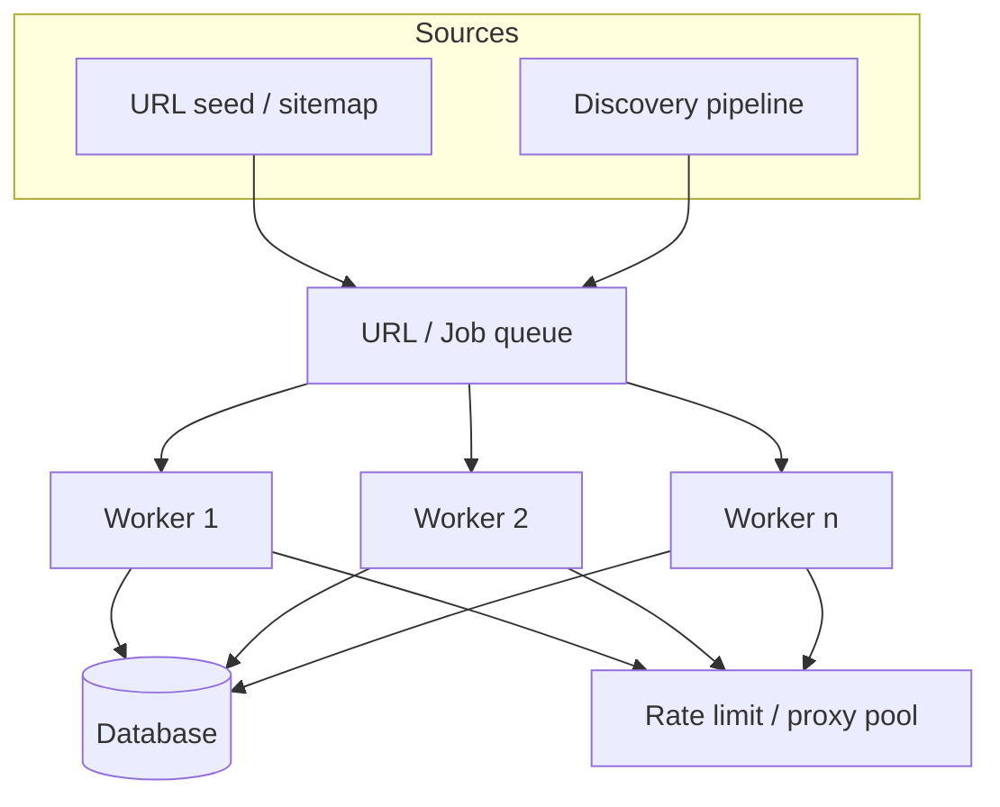
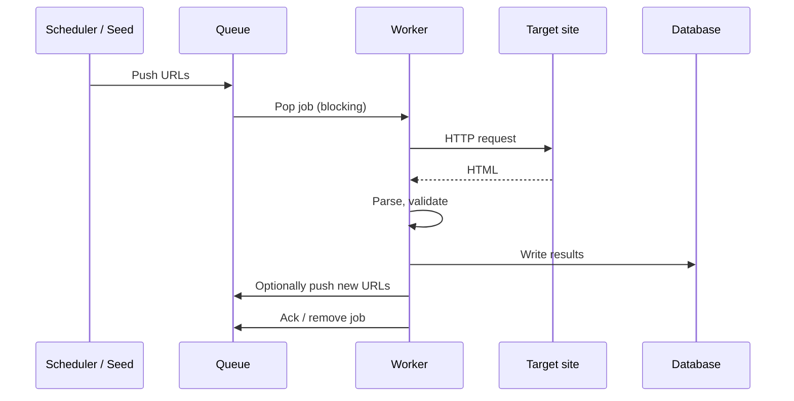

The URL list was growing faster than the single scraper could drain it. Adding more threads on the same box just meant more connection timeouts and a database that couldn't keep up with writes. The bottleneck had moved from "not enough requests" to "too much happening in one place."

That shift is common. A single-node scraper works until the job outgrows it: the target site has more pages than you can fetch in a reasonable window, or you hit rate limits because everything shares one IP, or the machine or the database becomes the limit. This article is about the patterns we use to scale data collection across multiple workers, with queues, and without turning the database or the target site into a bottleneck.

## When to Scale Out Instead of Up

Before adding nodes or queues, it helps to be clear about what's actually slow or blocked.

**Vertical scaling (bigger machine)** makes sense when:
- One process is CPU- or memory-bound (e.g. heavy parsing or large in-memory structures).
- You have a single worker and the bottleneck is that one machine's capacity.
- The workload is not easily parallelizable (e.g. one big sequential job).

**Horizontal scaling (more workers)** makes sense when:
- You're I/O-bound: waiting on HTTP, disk, or the database.
- You have a large set of independent tasks (e.g. many URLs) that can be split across workers.
- You need to spread load (e.g. rate limits per IP or per worker).
- A single node is a single point of failure and you want redundancy.

In scraping, we're usually I/O-bound and task-rich, so horizontal scaling is the default. The next step is how to distribute work and coordinate workers.

## Distributed Scraping Topology

A typical scaled setup looks like this: a **queue** holds work (URLs or jobs), and **multiple workers** pull from the queue, scrape, and write results somewhere shared (database or another queue for processing). Optionally, a **scheduler or seed process** pushes initial and follow-up URLs into the queue.

*Figure 1: Distributed scraping topology*

Workers share nothing except the queue and the backing store. They can run on one machine (multi-process) or across many (distributed). The queue decides who does what and smooths out bursts.

## Queue-Based Architecture: What to Use and When

The queue is the coordination point. It needs to be durable enough that you don't lose work, and fast enough that it doesn't become the bottleneck.

### Redis as a job queue

Redis lists or streams work well for a first step: simple, low latency, and many teams already run Redis for caching or sessions. You can use `LPUSH`/`BRPOP` (or `RPUSH`/`BLPOP`) for a simple FIFO queue, or Redis Streams for a more feature-rich option (consumer groups, acknowledgment, replay).

**Good fit:** Moderate throughput, single-region workers, and you're okay with best-effort durability (Redis can be configured for persistence, but it's not the same as a dedicated message broker).

**Limitation:** Under very high throughput or with many consumers, Redis can become a bottleneck; persistence and memory also need tuning.

### RabbitMQ (or similar brokers)

RabbitMQ gives you durable queues, acknowledgments, and routing (e.g. by domain or priority). Messages survive restarts; you can add dead-letter queues and retries.

**Good fit:** Higher throughput, need for durability and at-least-once delivery, or when you want separate queues per domain or priority.

**Trade-off:** More operational overhead (cluster, monitoring, disk I/O). You need to size and maintain it.

### AWS SQS (or other cloud queues)

SQS is managed: you don't run the broker. You get at-least-once delivery, retries, and dead-letter queues. Latency is a bit higher than Redis; cost scales with message volume.

**Good fit:** When you're already on AWS and want to avoid running RabbitMQ or Redis yourself. Good for decoupling workers from the seed/discovery process.

**Trade-off:** Vendor lock-in and per-request cost at very high volume. You still need to design for idempotency and duplicate handling.

### Choosing in practice

Start simple: Redis or a single RabbitMQ queue is enough for many projects. Move to RabbitMQ when you need stronger durability or more complex routing; use SQS when you want a managed queue and are fine with cloud boundaries. Avoid over-engineering the first version.

## Queue Processing Flow

Work flows one way: into the queue, then out to workers, then to storage or the next stage. Failed jobs can be retried (with backoff) or sent to a dead-letter queue for inspection.

*Figure 2: Queue processing flow*

Important details:
- **Idempotency:** The same URL can be queued or processed more than once. Deduplicate by URL (or job id) before writing, or use upserts so repeated runs don't create duplicates.
- **Acknowledgment:** Remove or ack the job only after you've successfully written or handed off the result. If the worker crashes before ack, the job can be re-queued or retried.
- **Backpressure:** If the database or downstream is slow, workers can block on writes. That naturally throttles how fast you pull from the queue and avoids unbounded memory or connection growth.

## Handling Rate Limits Across Workers

With many workers, you can hit the target site (or proxy) rate limits if every worker behaves independently. You need a shared view of "how much have we already sent" so the system stays under the limit.

**Centralized rate limiter:** One place (e.g. Redis) holds counters or token-bucket state per domain (or per API key). Every worker checks and updates it before each request. That way, 10 workers still respect a single "N requests per minute" limit.

**Per-worker or per-proxy limits:** If you have one proxy (or one IP) per worker, you can rate-limit per worker locally. Then the global limit is roughly (worker count × per-worker limit). This fits when you have a proxy pool and each worker uses a dedicated proxy.

**Pacing at the queue:** Instead of "pull and request immediately," you can have workers pull in batches and wait between batches, or use a delay queue so jobs become visible only after a cooldown. That spreads requests in time and helps stay under both per-IP and global limits.

In practice we often combine: a shared rate limiter in Redis for the critical domains, plus per-worker delays and proxy rotation (so each worker or pool of workers uses different IPs), so you don't rely on a single mechanism.

## Database Design for High-Volume Scraped Data

Workers write a lot of rows. The database can become the bottleneck (locks, disk I/O, connection limits). A few patterns help.

**Partitioning by time:** If your data is time-series (e.g. when the page was scraped), partition tables by week or month. Queries and maintenance (e.g. dropping old partitions) stay manageable, and you can archive or compress old partitions.

**Bulk inserts:** Prefer batch inserts (e.g. many rows per transaction) instead of one row per request. That reduces round-trips and transaction overhead. Flush every N rows or every T seconds, and make sure your schema and indexes support that.

**Indexing:** Index what you query (e.g. URL, domain, scraped_at). Avoid indexing every column; too many indexes slow down writes. Use composite indexes where you filter or sort on several columns.

**Connection pooling:** Each worker should use a small pool of connections, not one connection per request. That keeps total connections to the database under control when you have many workers.

A more detailed treatment of schema design, indexing, and partitioning for scraped data fits in a dedicated article; here the goal is to align the database with the write pattern of a distributed scraper so it doesn't become the bottleneck.

## Cost and Resource Allocation at Scale

More workers mean more CPU, memory, and often more egress and database load. A few principles help keep cost and reliability sane.

**Right-size workers:** Start with a small number of workers and scale up until you find the next bottleneck (queue, site rate limit, or database). Running more workers than the system can feed or drain just burns money and can make rate limits worse.

**Spot or preemptible instances:** If your jobs are fault-tolerant (re-queued on failure), running workers on spot or preemptible VMs can cut compute cost significantly. Design so that losing a worker only re-queues in-flight jobs.

**Batch and co-locate:** Group work by domain or site when possible. That improves cache locality and can reduce redundant requests. It also makes it easier to apply per-domain rate limits and backoff.

**Monitor and cap:** Track queue depth, throughput per worker, error rates, and database load. Set alerts when the queue grows without bound or when error rate spikes. That tells you when to add workers, when to back off, and when to fix the pipeline.

## Putting It Together: A Minimal Distributed Setup

Conceptually, you need:
1. A **queue** (Redis, RabbitMQ, or SQS) that holds URL jobs.
2. A **seed or scheduler** that pushes initial and discovered URLs into the queue.
3. **Workers** that pop jobs, fetch pages, parse, validate, and write to the database (and optionally push new URLs back to the queue).
4. **Shared rate limiting** (e.g. in Redis) so all workers respect site limits.
5. A **database** (and optionally a separate processing pipeline) that can handle concurrent writes, e.g. with partitioning and batch inserts.

Start with one queue and a few workers; add rate limiting and database tuning as you hit limits. Then scale out only where the bottlenecks are. That keeps the system understandable and cost-effective.

## Common Pitfalls

- **No backpressure:** Workers pull from the queue as fast as they can and overwhelm the database or the target site. Throttle at the worker or at the queue so the slowest stage sets the pace.
- **Ignoring duplicates:** The same URL can be queued multiple times (e.g. from sitemaps and links). Deduplicate before or during write so you don't double-count or double-write.
- **One big queue for everything:** If you mix fast and slow domains in one queue, slow jobs can delay fast ones. Consider separate queues or priority queues by domain or job type.
- **Skipping idempotency:** Crashes and retries mean some jobs run more than once. Design writes (and any side effects) to be idempotent so retries are safe.
- **Scaling workers without scaling the rest:** Adding workers without enough queue throughput, database capacity, or rate-limit headroom just moves the bottleneck. Measure and scale the whole path.

## Summary

- Scale **horizontally** when you're I/O-bound and have many independent tasks; use **vertical** scaling when one process is CPU- or memory-bound.
- Use a **queue** (Redis, RabbitMQ, or SQS) to distribute URL jobs across workers and smooth load.
- Implement **shared rate limiting** (e.g. in Redis) so multiple workers respect site and proxy limits.
- Design the **database** for high write throughput: partitioning, batch inserts, sensible indexes, and connection pooling.
- **Right-size** workers, use spot/preemptible where safe, and monitor queue depth and errors so you scale the whole pipeline, not just one layer.

Once the single-node scraper can't keep up, a queue and a pool of workers usually get you to the next order of magnitude. After that, the next bottleneck (rate limits, database, or cost) dictates the next change.
