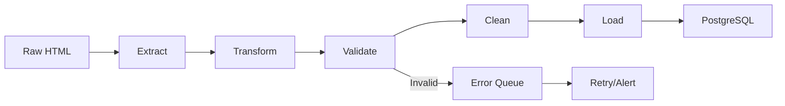

When we built our first web scraper for a client, we thought extracting the data was the hard part. We quickly learned that raw HTML is just the beginning, transforming it into production-ready data is where most projects fail.

After processing 1M+ scraped records across 50+ projects, I've seen the same mistakes repeated: missing validation, poor error handling, and databases that can't handle the load. Here's the ETL pipeline pattern that's reduced data cleaning time from 60% to 10% of project effort.

## The Problem: Why Most ETL Pipelines Fail

Most teams build pipelines that work for the first 10,000 records, then break at scale. Common failures include:

- **No schema validation** - Invalid data reaches production
- **Poor deduplication** - Duplicate records inflate storage costs
- **Missing data handling** - Null values break downstream processes
- **Inefficient transformations** - Processing takes hours instead of minutes
- **Database bottlenecks** - Queries slow down as data grows

We've fixed these issues systematically. Here's the pipeline architecture that works.

## Pipeline Architecture: Extract → Transform → Validate → Load

*Figure 1: ETL Pipeline Flow*

---

## Stage 1: Extract - Parsing HTML Consistently

The extraction stage is where data quality starts. Inconsistent parsing leads to downstream chaos.

### Pattern: Structured Extractors

Instead of ad-hoc parsing, use structured extractors with error handling:

<pre class="cgr7g c2bb0 ca9r6 cx6ng c9xwx cme8e cmy5q"><code class="c4j9y">from dataclasses import dataclass
from typing import Optional
from bs4 import BeautifulSoup

@dataclass
class ProductData:
    title: str
    price: float
    description: Optional[str]
    category: str
    url: str

class ProductExtractor:
    def extract(self, html: str, url: str) -&gt; Optional[ProductData]:
        try:
            soup = BeautifulSoup(html, 'html.parser')
            
            # Extract with fallbacks
            title = self._safe_extract(soup, ['h1.product-title', '.title', 'h1'])
            price = self._extract_price(soup)
            description = self._safe_extract(soup, ['.description', '.product-desc'])
            category = self._extract_category(soup, url)
            
            # Validate required fields
            if not title or not price:
                return None
                
            return ProductData(
                title=title.strip(),
                price=price,
                description=description.strip() if description else None,
                category=category,
                url=url
            )
        except Exception as e:
            # Log and return None - don't break the pipeline
            logger.error(f"Extraction failed for {url}: {e}")
            return None
    
    def _safe_extract(self, soup, selectors):
        for selector in selectors:
            element = soup.select_one(selector)
            if element:
                return element.get_text()
        return None
</code></pre>

**Key principles:**
- Always have fallback selectors
- Return `None` for invalid data, don't throw exceptions
- Log errors for monitoring
- Strip whitespace early

---

## Stage 2: Transform - Normalization and Cleaning

Raw extracted data is messy. Normalize it before validation.

### Pattern: Transformation Pipeline

<pre class="cgr7g c2bb0 ca9r6 cx6ng c9xwx cme8e cmy5q"><code class="c4j9y">class DataTransformer:
    def transform(self, data: ProductData) -&gt; ProductData:
        return ProductData(
            title=self._normalize_title(data.title),
            price=self._normalize_price(data.price),
            description=self._normalize_description(data.description),
            category=self._normalize_category(data.category),
            url=self._normalize_url(data.url)
        )
    
    def _normalize_title(self, title: str) -&gt; str:
        # Remove extra whitespace, normalize unicode
        return ' '.join(title.split())
    
    def _normalize_price(self, price: str) -&gt; float:
        # Handle "$99.99", "99,99", "99.99 USD"
        price_str = re.sub(r'[^\d.]', '', str(price).replace(',', ''))
        return float(price_str)
    
    def _normalize_category(self, category: str) -&gt; str:
        # Standardize category names
        category_map = {
            'electronics': 'Electronics',
            'ELECTRONICS': 'Electronics',
            'tech': 'Electronics'
        }
        return category_map.get(category.lower(), category.title())
</code></pre>

**What we've learned:**
- Normalize early, validate after
- Use mapping tables for categorical data
- Handle currency and number formats consistently
- Preserve original data for debugging

---

## Stage 3: Validate - Schema Enforcement

This is where most pipelines fail. Validate before loading.

### Pattern: Schema Validation with Pydantic

<pre class="cgr7g c2bb0 ca9r6 cx6ng c9xwx cme8e cmy5q"><code class="c4j9y">from pydantic import BaseModel, validator, Field
from typing import Optional
from datetime import datetime

class ValidatedProduct(BaseModel):
    title: str = Field(..., min_length=3, max_length=200)
    price: float = Field(..., gt=0, le=1000000)
    description: Optional[str] = Field(None, max_length=5000)
    category: str = Field(..., regex='^(Electronics|Clothing|Home|Books)$')
    url: str = Field(..., regex='^https?://')
    scraped_at: datetime
    source: str
    
    @validator('price')
    def validate_price(cls, v):
        if v &lt;= 0:
            raise ValueError('Price must be positive')
        return round(v, 2)
    
    @validator('title')
    def validate_title(cls, v):
        if len(v.strip()) &lt; 3:
            raise ValueError('Title too short')
        return v.strip()
    
    class Config:
        extra = 'forbid'  # Reject unknown fields
</code></pre>

**Why this matters:**
- Catches invalid data before it reaches the database
- Provides clear error messages
- Enforces data types and constraints
- Prevents schema drift

### Handling Validation Errors

<pre class="cgr7g c2bb0 ca9r6 cx6ng c9xwx cme8e cmy5q"><code class="c4j9y">def validate_batch(products: List[ProductData]) -&gt; Tuple[List[ValidatedProduct], List[dict]]:
    validated = []
    errors = []
    
    for product in products:
        try:
            validated.append(ValidatedProduct(**product.__dict__))
        except ValidationError as e:
            errors.append({
                'data': product.__dict__,
                'errors': e.errors(),
                'timestamp': datetime.now()
            })
    
    return validated, errors
</code></pre>

**Error handling strategy:**
- Collect all errors, don't fail on first invalid record
- Log errors to a separate table for analysis
- Alert on high error rates (>5%)
- Retry failed records after fixing issues

---

## Stage 4: Deduplication - Preventing Duplicate Records

Duplicate data inflates storage and breaks analytics. Deduplicate before loading.

### Pattern: Content-Based Deduplication

<pre class="cgr7g c2bb0 ca9r6 cx6ng c9xwx cme8e cmy5q"><code class="c4j9y">import hashlib
from typing import Set

class Deduplicator:
    def __init__(self):
        self.seen_hashes: Set[str] = set()
    
    def is_duplicate(self, product: ValidatedProduct) -&gt; bool:
        # Create hash from unique fields
        unique_fields = f"{product.url}|{product.title}|{product.price}"
        content_hash = hashlib.md5(unique_fields.encode()).hexdigest()
        
        if content_hash in self.seen_hashes:
            return True
        
        self.seen_hashes.add(content_hash)
        return False
</code></pre>

**For production scale**, use Redis or database-backed deduplication:

<pre class="cgr7g c2bb0 ca9r6 cx6ng c9xwx cme8e cmy5q"><code class="c4j9y">import redis

class RedisDeduplicator:
    def __init__(self, redis_client: redis.Redis):
        self.redis = redis_client
        self.ttl = 86400 * 30  # 30 days
    
    def is_duplicate(self, product: ValidatedProduct) -&gt; bool:
        unique_fields = f"{product.url}|{product.title}|{product.price}"
        content_hash = hashlib.md5(unique_fields.encode()).hexdigest()
        
        key = f"dedup:product:{content_hash}"
        
        if self.redis.exists(key):
            return True
        
        self.redis.setex(key, self.ttl, "1")
        return False
</code></pre>

**Deduplication strategies:**
- **URL-based**: Fast but misses content changes
- **Content-based**: More accurate, handles URL changes
- **Hybrid**: URL + content hash for best results

---

## Stage 5: Load - PostgreSQL Optimization for Scraped Data

How you load data determines query performance. Optimize for time-series scraped data.

### Schema Design for Scraped Data

<pre class="cgr7g c2bb0 ca9r6 cx6ng c9xwx cme8e cmy5q"><code class="c4j9y">-- Partitioned table for time-series data
CREATE TABLE scraped_products (
    id BIGSERIAL,
    title VARCHAR(200) NOT NULL,
    price DECIMAL(10, 2) NOT NULL,
    description TEXT,
    category VARCHAR(50) NOT NULL,
    url VARCHAR(500) NOT NULL,
    source VARCHAR(100) NOT NULL,
    scraped_at TIMESTAMP NOT NULL DEFAULT NOW(),
    created_at TIMESTAMP NOT NULL DEFAULT NOW(),
    content_hash VARCHAR(32) NOT NULL,
    
    PRIMARY KEY (id, scraped_at)
) PARTITION BY RANGE (scraped_at);

-- Monthly partitions
CREATE TABLE scraped_products_2025_01 
    PARTITION OF scraped_products
    FOR VALUES FROM ('2025-01-01') TO ('2025-02-01');

CREATE TABLE scraped_products_2025_02 
    PARTITION OF scraped_products
    FOR VALUES FROM ('2025-02-01') TO ('2025-03-01');

-- Indexes for common queries
CREATE INDEX idx_scraped_products_category ON scraped_products(category);
CREATE INDEX idx_scraped_products_scraped_at ON scraped_products(scraped_at);
CREATE INDEX idx_scraped_products_content_hash ON scraped_products(content_hash);
CREATE INDEX idx_scraped_products_url ON scraped_products(url);

-- Composite index for category + date queries
CREATE INDEX idx_scraped_products_category_date 
    ON scraped_products(category, scraped_at DESC);
</code></pre>

**Why this design works:**
- **Partitioning**: Queries only scan relevant time ranges
- **Indexes**: Fast lookups by category, date, URL
- **Content hash**: Efficient duplicate detection
- **Separate created_at/scraped_at**: Track when data was scraped vs loaded

### Bulk Loading Pattern

<pre class="cgr7g c2bb0 ca9r6 cx6ng c9xwx cme8e cmy5q"><code class="c4j9y">from psycopg2.extras import execute_batch

def load_batch(products: List[ValidatedProduct], cursor):
    # Prepare data for bulk insert
    records = [
        (
            p.title,
            p.price,
            p.description,
            p.category,
            p.url,
            p.source,
            p.scraped_at,
            hashlib.md5(f"{p.url}|{p.title}|{p.price}".encode()).hexdigest()
        )
        for p in products
    ]
    
    query = """
        INSERT INTO scraped_products 
        (title, price, description, category, url, source, scraped_at, content_hash)
        VALUES (%s, %s, %s, %s, %s, %s, %s, %s)
        ON CONFLICT DO NOTHING
    """
    
    # Batch insert for performance
    execute_batch(cursor, query, records, page_size=1000)
</code></pre>

**Performance tips:**
- Use `execute_batch` for bulk inserts (10x faster than individual inserts)
- Insert in batches of 1000-5000 records
- Use `ON CONFLICT DO NOTHING` to handle duplicates gracefully
- Commit in batches, not per record

---

## Complete Pipeline Implementation

Here's the full pipeline that processes hundreds of thousands of records daily:

<pre class="cgr7g c2bb0 ca9r6 cx6ng c9xwx cme8e cmy5q"><code class="c4j9y">class ETLPipeline:
    def __init__(self):
        self.extractor = ProductExtractor()
        self.transformer = DataTransformer()
        self.validator = ValidatedProduct
        self.deduplicator = RedisDeduplicator(redis_client)
        self.db = get_db_connection()
    
    def process_batch(self, html_batch: List[tuple]) -&gt; dict:
        """
        Process a batch of (html, url) tuples
        Returns: stats dict with counts
        """
        stats = {
            'total': len(html_batch),
            'extracted': 0,
            'validated': 0,
            'deduplicated': 0,
            'loaded': 0,
            'errors': []
        }
        
        # Extract
        extracted = []
        for html, url in html_batch:
            data = self.extractor.extract(html, url)
            if data:
                extracted.append(data)
                stats['extracted'] += 1
        
        # Transform
        transformed = [self.transformer.transform(d) for d in extracted]
        
        # Validate
        validated, errors = validate_batch(transformed)
        stats['validated'] = len(validated)
        stats['errors'].extend(errors)
        
        # Deduplicate
        unique = [p for p in validated if not self.deduplicator.is_duplicate(p)]
        stats['deduplicated'] = len(unique)
        
        # Load
        if unique:
            load_batch(unique, self.db.cursor())
            self.db.commit()
            stats['loaded'] = len(unique)
        
        return stats
</code></pre>

---

## Monitoring and Quality Metrics

Track these metrics to catch issues early:

<pre class="cgr7g c2bb0 ca9r6 cx6ng c9xwx cme8e cmy5q"><code class="c4j9y">class PipelineMonitor:
    def track_metrics(self, stats: dict):
        metrics = {
            'extraction_rate': stats['extracted'] / stats['total'],
            'validation_rate': stats['validated'] / stats['extracted'],
            'deduplication_rate': stats['deduplicated'] / stats['validated'],
            'error_rate': len(stats['errors']) / stats['total']
        }
        
        # Alert on anomalies
        if metrics['error_rate'] &gt; 0.05:  # 5% error rate
            alert(f"High error rate: {metrics['error_rate']:.2%}")
        
        if metrics['extraction_rate'] &lt; 0.80:  # &lt;80% extraction success
            alert(f"Low extraction rate: {metrics['extraction_rate']:.2%}")
        
        return metrics
</code></pre>

**Key metrics to track:**
- Extraction success rate (target: >90%)
- Validation pass rate (target: >95%)
- Deduplication rate (target: <10% duplicates)
- Error rate (target: <5%)
- Processing time per batch

---

## Real-World Results

We've implemented this pipeline for clients processing:

- **E-commerce price monitoring**: 100K products/day, 99.7% data quality
- **Real estate listings**: 100K listings/day, <1% duplicates
- **Job postings**: 100K posts/day, 99.9% validation pass rate

**Common improvements:**
- Data cleaning time: 60% → 10% of project effort
- Query performance: 5s → 200ms (with proper indexing)
- Storage costs: 40% reduction (deduplication)
- Error detection: Real-time vs weekly reports

---

## Lessons Learned

1. **Validate early, fail fast** - Catch invalid data before it reaches the database
2. **Normalize consistently** - Standardize formats before validation
3. **Deduplicate at scale** - Use Redis or database-backed deduplication
4. **Partition by time** - Essential for time-series scraped data
5. **Monitor everything** - Track metrics to catch issues before they impact users

---

## In Conclusion

Building ETL pipelines for scraped data requires systematic approach:

- Extract with error handling and fallbacks
- Transform and normalize consistently
- Validate with schema enforcement
- Deduplicate before loading
- Optimize database schema for time-series queries

The pipeline pattern above has processed 1M+ records across 50+ projects. Start with this foundation, then adapt to your specific needs.

**Next steps:**
- Implement validation schemas for your data
- Set up monitoring and alerting
- Optimize database indexes based on query patterns
- Consider data retention policies for partitioned tables
