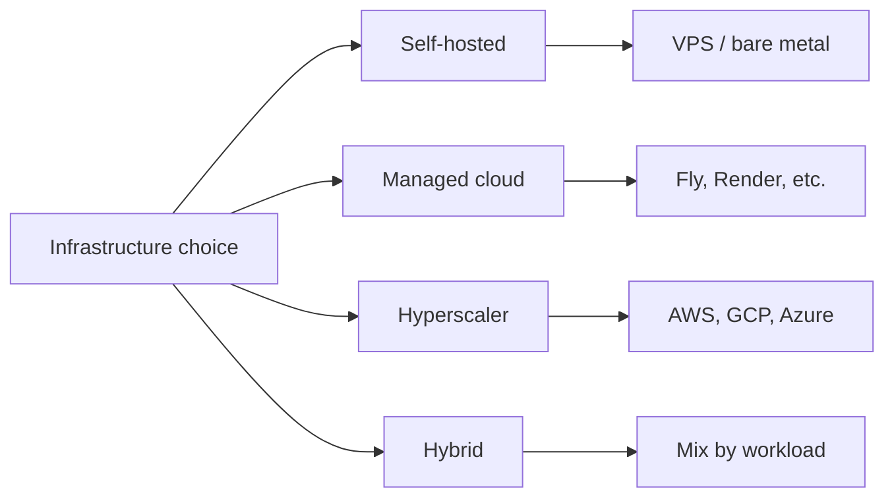
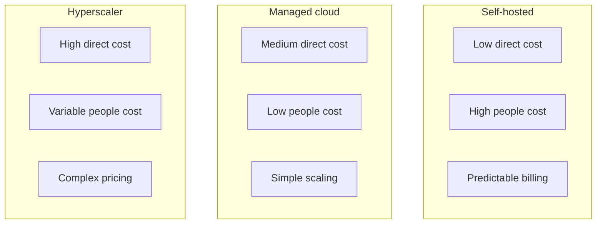
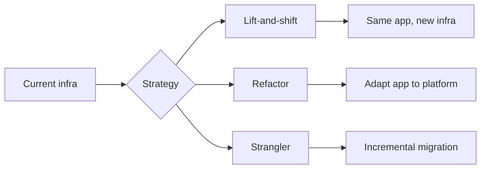

A product team moved their app to a hyperscaler to "scale with growth." Twelve months later, the cloud bill was 3x what they had budgeted. Nobody had counted support, data transfer, or the extra environments. Another team went full self-hosted to "control costs." Six months in, they were spending two engineers full-time on patching, backups, and incidents. The infra was cheap, the people cost was not.

Picking cloud, self-hosted, or a mix is rarely about which option is "best." It's about fit: your team size, risk tolerance, compliance needs, and how much you want to run yourself. Below is a framework we use to compare options and decide, including TCO, ops burden, security and compliance, and how to migrate without blowing the budget.

## What You're Really Choosing

Three broad options show up in almost every infrastructure discussion:

- **Self-hosted** – You run servers (owned or rented VPS/bare metal). You handle OS, runtimes, backups, monitoring, and incidents.
- **Cloud (managed platforms)** – A provider runs the infrastructure; you run your app. Examples: Fly.io, Render, Railway, Heroku. You get less control and less ops.
- **Hyperscaler (AWS, GCP, Azure)** – Full suite of services (compute, storage, DB, networking, etc.). Maximum flexibility and complexity; you still own a lot of configuration and operations.

Hybrid mixes these: for example, app on a managed platform and database self-hosted, or core in one cloud and edge in another.

*Figure 1: Infrastructure options*

The rest of this article is about how to compare them in a structured way.

## A TCO Framework That Includes Hidden Costs

Total cost of ownership (TCO) is the standard way to compare infrastructure. If you only compare list prices, you miss most of the cost.

### What Belongs in TCO

TCO should include:

**Direct costs**
- Compute (VMs, containers, server rental)
- Storage and backups
- Data transfer (egress often dominates on cloud)
- Licenses (OS, DB, monitoring, etc.)
- Support and subscriptions

**Indirect costs (people and time)**
- Time spent on: provisioning, config, patching, upgrades, monitoring, incident response
- On-call and escalation
- Training and hiring for the chosen stack

**Risk and opportunity**
- Downtime and lost revenue
- Security or compliance incidents
- Delayed feature work because the team is stuck on infra

### A Simple TCO Template

Use a spreadsheet and a fixed time horizon (e.g. 3 years). Fill in your own numbers.

<pre class="cgr7g c2bb0 ca9r6 cx6ng c9xwx cme8e cmy5q"><code class="c4j9y"># TCO categories (example: 3-year horizon)

Direct costs:
  compute_monthly = 200   # Servers / instances
  storage_monthly = 50
  bandwidth_monthly = 80   # Often underestimated on cloud
  backups_monthly = 30
  support_subscriptions = 100

Indirect (people) costs:
  hours_per_month_infra_work = 40   # Patching, config, incidents
  fully_loaded_hourly_rate = 80   # Adjust for your team
  people_cost_monthly = hours_per_month_infra_work * fully_loaded_hourly_rate

TCO_36_months = (compute_monthly + storage_monthly + bandwidth_monthly +
                 backups_monthly + support_subscriptions + people_cost_monthly) * 36
</code></pre>

**Why this matters:** Self-hosted often wins on direct cost and loses once you add 20–40 hours/month of engineering time. Cloud and hyperscaler look expensive until you factor in less patching, fewer on-call pages, and faster provisioning.

### TCO Comparison Sketch

*Figure 2: TCO drivers by option*

Run the numbers for your own team size and workload. Small teams usually find managed cloud or a small hybrid cheapest once people cost is in. Larger teams with dedicated platform engineers can make self-hosted or hyperscaler pay off.

## Operational Overhead: What You Actually Have to Run

Infrastructure creates ongoing work. The difference between options is how much and who does it.

### Self-hosted

You own:

- OS and runtime updates, security patches
- Backups, restore testing, disaster recovery (DR)
- Monitoring, alerting, on-call
- Capacity planning and hardware or VM upgrades
- Networking, DNS, TLS (if not behind a CDN)

Rough order of magnitude: 20–60 hours/month for a small production stack (app, DB, cache, backups), depending on how much you automate. More if you have compliance or multi-datacenter needs.

### Managed cloud (Fly, Render, Railway, etc.)

Provider typically handles:

- OS and runtime patching
- Basic monitoring and health checks
- TLS and often global routing
- Backups (often included or add-on)

You still own:

- App and dependency updates
- Config and secrets
- Observability (logs, traces, metrics) beyond basics
- Scaling and cost controls

Overhead often drops to 5–15 hours/month for a similar stack.

### Hyperscaler (AWS, GCP, Azure)

You get building blocks, not a single "platform." You choose and configure:

- Compute (EC2, ECS, Lambda, etc.)
- Databases (RDS, DynamoDB, etc.)
- Networking (VPC, load balancers, etc.)
- IAM, logging, cost controls

Overhead can be 15–40+ hours/month depending on how many services you use and how strict your security and compliance requirements are. Dedicated platform/SRE teams are common.

### Comparison Table

| Activity | Self-hosted | Managed cloud | Hyperscaler |
|----------|-------------|---------------|-------------|
| OS/runtime patching | You | Provider | You (or managed services) |
| Backups & restore | You | Provider / add-on | You or managed |
| Monitoring & alerting | You | Basic from provider | You (CloudWatch, etc.) |
| Scaling | You | Often automatic | You configure |
| Networking & TLS | You | Usually included | You configure |
| Cost predictability | High | Medium | Low unless tightly governed |

Use this to estimate "hours per month" for your team and feed that into TCO as people cost.

## Security and Compliance

Security and compliance can push you toward or away from certain options.

### Data residency and sovereignty

Some data must stay in a specific country or region (e.g. EU, UK). That affects:

- **Self-hosted:** You choose where the servers are.
- **Managed cloud:** Check provider regions and where data and backups live.
- **Hyperscaler:** Regions and compliance certifications are well documented; you must pick the right region and services.

If you have strict residency requirements, rule out providers or regions that cannot comply before comparing TCO.

### Certifications and compliance

Common expectations:

- **SOC 2 (Type II)** – Many enterprises require it for vendors. Most hyperscalers and many managed platforms have it; small VPS providers often do not.
- **GDPR** – Data processing agreements (DPA), retention, and deletion. You need a provider that can sign a DPA and support your obligations.
- **HIPAA, PCI-DSS** – Industry-specific. Hyperscalers offer compliant services and BAAs; managed platforms may or may not.

If you are in a regulated industry or sell to enterprises, list the required certifications and filter options accordingly. Self-hosted does not remove compliance work; you still need policies, access control, and evidence.

### Shared responsibility

- **Self-hosted:** You are responsible for the full stack (physical security is the provider’s, e.g. datacenter).
- **Cloud:** Provider secures the platform and underlying infra; you secure your app, config, data, and access. Document who does what and verify it matches your risk model.

Security and compliance often narrow the set of viable options before you do detailed TCO.

## When to Use Which (Use Case Snapshot)

No single table fits every team, but this is a useful starting point.

**Self-hosted tends to fit when:**

- You need strict control over where and how data is stored (sovereignty, legacy).
- Workloads are stable and predictable; you can size and leave them.
- You have (or will hire) people who want to run infra and you can afford the ongoing cost.
- Direct cost is a major constraint and you can invest in automation to keep people cost down.

**Managed cloud tends to fit when:**

- The team is small and wants to focus on product, not servers.
- You want fast, simple deploys and scaling without building a platform.
- You don’t need deep hyperscaler services (e.g. proprietary ML, complex networking).
- You want a single, understandable bill and less operational surprise.

**Hyperscaler tends to fit when:**

- You need a wide range of services (queues, ML, global load balancer, etc.) in one place.
- You have or plan platform/SRE capacity to design and operate it.
- Enterprise or regulated customers require specific certifications and regions.
- You are building a large or long-lived system where flexibility matters more than simplicity.

**Hybrid tends to fit when:**

- You want managed app hosting but need your own DB (e.g. for cost or control).
- You keep legacy or sensitive parts on-prem or self-hosted and put new or public-facing parts in cloud.
- You use different providers for different layers (e.g. edge vs. core) to optimize cost or performance.

These are guidelines. Your TCO and compliance constraints will refine the choice.

## Migration Strategies: Lift-and-Shift vs Refactor vs Strangler

Moving from one model to another (e.g. self-hosted to cloud, or one cloud to another) is a project. How you migrate affects cost and risk.

### Lift-and-shift (rehost)

You move the same app and data to new infrastructure with minimal code changes. Good when:

- You need to move quickly (e.g. contract or hardware end-of-life).
- The app is already reasonably portable (e.g. stateless app + DB).
- You accept that you might not optimize for the new environment right away.

Risks: You carry over old assumptions (e.g. local disk, single region). Run a short pilot and validate backups, networking, and failover before full cutover.

### Refactor (replatform / revise)

You change some parts of the stack (e.g. move to managed DB, replace custom queue with a managed one) while migrating. Good when:

- You have time and capacity to adapt the app.
- The target platform offers clear benefits (managed DB, better scaling).
- You want to reduce operational burden as part of the move.

Cost and timeline are higher than lift-and-shift; you get a better long-term fit.

### Strangler fig (incremental replacement)

You run old and new in parallel and gradually shift traffic and data. Good when:

- You cannot afford a big-bang cutover.
- The system is large or critical; you want small, reversible steps.
- You can route by feature or user segment (e.g. new users on new stack).

You need a way to route traffic (LB, feature flags, or DNS) and a plan for data (sync, dual-write, or eventual cutover). Slower, but lower risk.

*Figure 3: Migration strategies*

Choose based on timeline, risk tolerance, and how much you want to change the app.

## Putting It Together: A Simple Decision Flow

1. **Constraints first** – List hard requirements: data residency, certifications, budget cap, timeline. Drop options that cannot meet them.
2. **Estimate TCO** – For the remaining options, plug in direct costs and a realistic estimate of monthly infra effort (hours × fully loaded rate). Use a 3-year (or your planning) horizon.
3. **Compare ops burden** – Who patches, backs up, runs on-call? Does that match your team size and skills?
4. **Check security and compliance** – Confirm regions, DPAs, and certifications. Document shared responsibility.
5. **Decide and document** – Pick an option (or hybrid) and write down why, what you assumed, and when you’ll revisit (e.g. in 12–18 months or when a key assumption changes).

Revisit when team size, compliance requirements, or workload change significantly.

## Common Pitfalls

- **Comparing only list price** – Ignoring people cost and risk makes self-hosted look better than it often is for small teams.
- **Ignoring egress and support** – On hyperscalers, data transfer and support tiers can double or more of the "obvious" bill.
- **Assuming cloud is always "easier"** – Managed cloud is; raw hyperscaler can be as complex as self-hosted if you use many services.
- **No migration plan** – "We’ll move later" without a strategy or pilot often means you never do, or do it in a crisis.
- **Treating the decision as permanent** – Revisit when constraints or costs change; hybrid and migration paths exist for a reason.

## Summary

- **Cloud vs self-hosted vs hybrid** is about fit: cost (TCO, including people), ops burden, security, and compliance.
- Use a **TCO framework** that includes direct cost, people time, and risk; run it over 3 years (or your horizon).
- **Operational overhead** differs a lot: self-hosted is highest, managed cloud usually lowest for a given stack, hyperscaler in the middle and highly variable.
- **Security and compliance** (residency, SOC 2, GDPR, etc.) often eliminate some options early; check before deep TCO.
- **Migration** can be lift-and-shift (fast, higher risk), refactor (better fit, more effort), or strangler (incremental, lower risk).

Choose based on your team, constraints, and numbers. Then document the decision and schedule a review so the choice stays aligned with reality.
