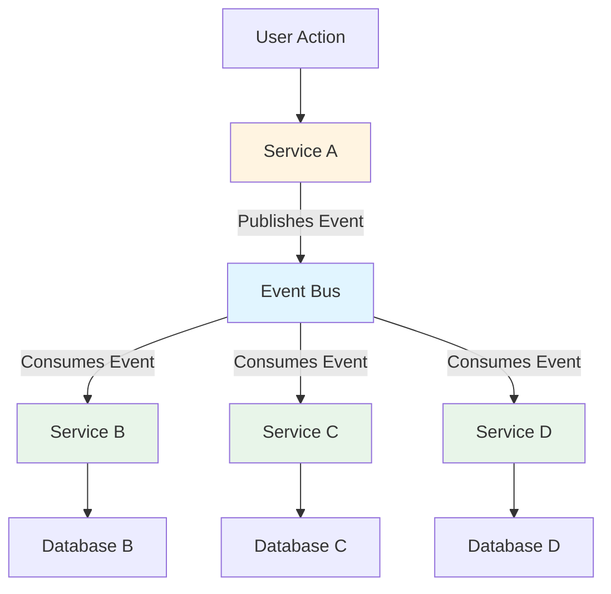
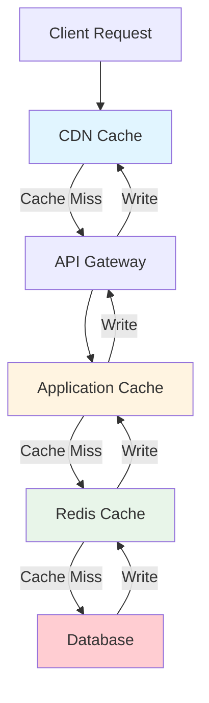
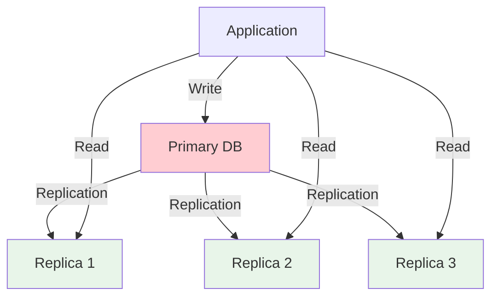
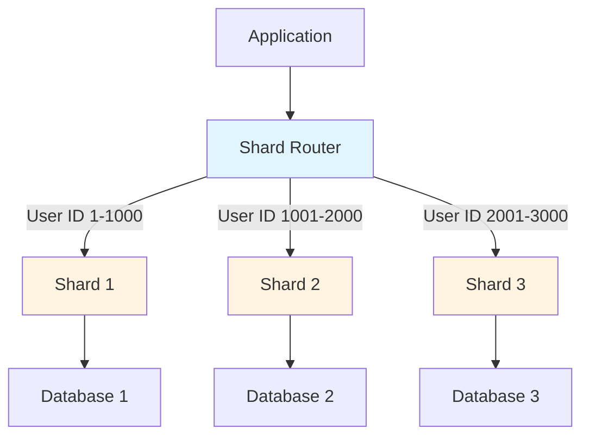
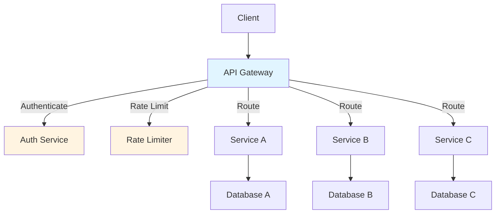
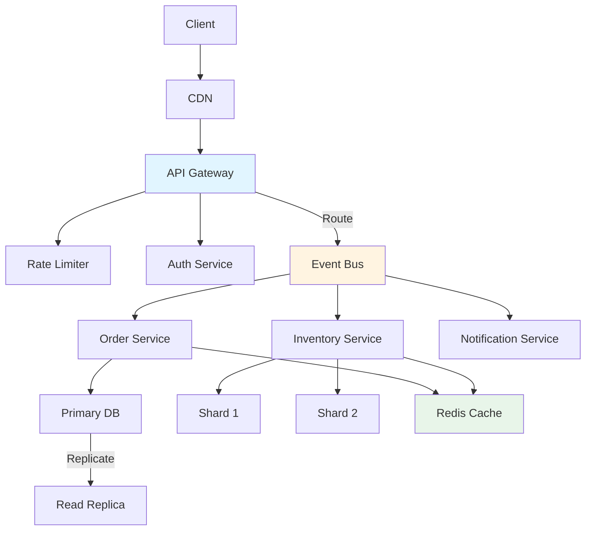

When a client's e-commerce platform hit 100K daily users, their monolithic API started failing under load. Response times jumped from 200ms to 5 seconds, and database connections maxed out. We didn't rebuild everything. Instead, we applied targeted architecture patterns that increased throughput by 10x without a full rewrite.

After scaling 20+ systems from startup to enterprise, I've seen the same bottlenecks repeat: synchronous processing, database overload, and missing caching layers. Here are the architecture patterns that actually work at scale.

## The Challenge: Architecture That Scales

Most systems are built for current load, not growth. When traffic increases 10x, they hit predictable bottlenecks:

- **Synchronous processing** - One slow request blocks others
- **Database overload** - Single database becomes the bottleneck
- **Missing caching** - Repeated queries hit the database unnecessarily
- **Tight coupling** - Services can't scale independently
- **No request aggregation** - Multiple services called sequentially

These patterns address these bottlenecks systematically.

## Pattern 1: Event-Driven Architecture

Event-driven architecture decouples services by using events as the communication mechanism. Instead of services calling each other directly, they publish and consume events.

### Architecture Overview

*Figure 1: Event-Driven Architecture Flow*

### When to Use Event-Driven Architecture

**Use when:**
- Multiple services need to react to the same event
- Services should operate independently (loose coupling)
- You need asynchronous processing
- Services have different scaling requirements

**Avoid when:**
- Simple CRUD operations (overhead not worth it)
- Strong consistency required (events are eventually consistent)
- Low traffic (synchronous is simpler)

### Implementation Pattern: Event Bus with Message Queue

<pre class="cgr7g c2bb0 ca9r6 cx6ng c9xwx cme8e cmy5q"><code class="c4j9y"># Event publisher pattern
from redis import Redis
import json

redis_client = Redis(host='localhost', port=6379)

class EventPublisher:
    def publish(self, event_type: str, payload: dict):
        """Publish event to message queue."""
        event = {
            "type": event_type,
            "payload": payload,
            "timestamp": datetime.utcnow().isoformat(),
            "event_id": str(uuid.uuid4())
        }
        
        # Publish to Redis Stream (or RabbitMQ, Kafka, etc.)
        redis_client.xadd(
            'events',
            event,
            maxlen=10000  # Keep last 10K events
        )

# Usage: Order service publishes order_created event
publisher = EventPublisher()
publisher.publish(
    event_type="order_created",
    payload={
        "order_id": "12345",
        "user_id": "67890",
        "total": 99.99,
        "items": ["item1", "item2"]
    }
)
</code></pre>

<pre class="cgr7g c2bb0 ca9r6 cx6ng c9xwx cme8e cmy5q"><code class="c4j9y"># Event consumer pattern
class EventConsumer:
    def __init__(self, service_name: str):
        self.service_name = service_name
        self.redis = Redis(host='localhost')
    
    def consume(self, event_types: list):
        """Consume events from stream."""
        while True:
            # Read from stream with consumer group
            messages = self.redis.xreadgroup(
                'order_processing_group',
                self.service_name,
                {'events': '>'},
                count=10,
                block=1000  # Block 1 second
            )
            
            for stream, events in messages:
                for event_id, event_data in events:
                    event = json.loads(event_data[b'event'])
                    
                    if event['type'] in event_types:
                        try:
                            self.handle_event(event)
                            # Acknowledge successful processing
                            self.redis.xack('events', 'order_processing_group', event_id)
                        except Exception as e:
                            # Log error, retry logic here
                            logger.error(f"Failed to process event {event_id}: {e}")
    
    def handle_event(self, event: dict):
        """Handle specific event type."""
        if event['type'] == 'order_created':
            # Update inventory, send email, update analytics
            self.process_order(event['payload'])
</code></pre>

### Benefits of Event-Driven Architecture

**Scalability:**
- Services scale independently based on their load
- Add new consumers without modifying publishers
- Horizontal scaling by adding more consumer instances

**Resilience:**
- If one consumer fails, others continue processing
- Events are persisted (can replay on failure)
- Loose coupling reduces cascade failures

**Real-world impact:**
- Reduced API response time from 2s to 200ms (async processing)
- Inventory service scaled separately from order service (10x traffic handled)
- Added analytics service without touching order service

---

## Pattern 2: Multi-Layer Caching Strategy

Caching reduces database load and improves response times. The key is using multiple cache layers strategically.

### Cache Layer Architecture

*Figure 2: Multi-Layer Caching Architecture*

### Layer 1: CDN Caching (Static & API Responses)

**Use for:**
- Static assets (images, CSS, JS)
- Public API responses that don't change frequently
- Geographic distribution (reduce latency)

**Implementation:**

<pre class="cgr7g c2bb0 ca9r6 cx6ng c9xwx cme8e cmy5q"><code class="c4j9y"># API response with CDN caching headers
from flask import Flask, jsonify
from functools import wraps

def cache_response(max_age: int = 3600):
    """Decorator to add cache headers to API responses."""
    def decorator(f):
        @wraps(f)
        def wrapped(*args, **kwargs):
            response = f(*args, **kwargs)
            response.headers['Cache-Control'] = f'public, max-age={max_age}'
            response.headers['ETag'] = generate_etag(response.data)
            return response
        return wrapped
    return decorator

@app.route('/api/v1/products')
@cache_response(max_age=1800)  # Cache for 30 minutes
def get_products():
    # CDN will cache this response
    return jsonify(get_all_products())
</code></pre>

### Layer 2: Application-Level Cache (In-Memory)

**Use for:**
- Frequently accessed data that changes rarely
- Configuration data
- Session data

**Implementation:**

<pre class="cgr7g c2bb0 ca9r6 cx6ng c9xwx cme8e cmy5q"><code class="c4j9y"># Simple in-memory cache with TTL
from datetime import datetime, timedelta
from threading import Lock

class InMemoryCache:
    def __init__(self, default_ttl: int = 300):
        self.cache = {}
        self.default_ttl = default_ttl
        self.lock = Lock()
    
    def get(self, key: str):
        with self.lock:
            if key in self.cache:
                value, expires_at = self.cache[key]
                if datetime.now() &lt; expires_at:
                    return value
                else:
                    del self.cache[key]
            return None
    
    def set(self, key: str, value, ttl: int = None):
        ttl = ttl or self.default_ttl
        expires_at = datetime.now() + timedelta(seconds=ttl)
        with self.lock:
            self.cache[key] = (value, expires_at)
</code></pre>

### Layer 3: Distributed Cache (Redis)

**Use for:**
- Shared cache across multiple application instances
- Session storage
- Rate limiting counters
- Real-time data that changes frequently

**Implementation:**

<pre class="cgr7g c2bb0 ca9r6 cx6ng c9xwx cme8e cmy5q"><code class="c4j9y"># Redis cache-aside pattern
from redis import Redis
import json
import hashlib

class RedisCache:
    def __init__(self, redis_client: Redis):
        self.redis = redis_client
    
    def get_or_set(self, key: str, fetch_fn, ttl: int = 3600):
        """Cache-aside pattern: check cache, if miss, fetch and cache."""
        # Try cache first
        cached = self.redis.get(key)
        if cached:
            return json.loads(cached)
        
        # Cache miss: fetch from source
        data = fetch_fn()
        
        # Store in cache
        self.redis.setex(
            key,
            ttl,
            json.dumps(data)
        )
        
        return data
    
    def invalidate(self, pattern: str):
        """Invalidate all keys matching pattern."""
        for key in self.redis.scan_iter(match=pattern):
            self.redis.delete(key)

# Usage
cache = RedisCache(Redis())

def get_user_profile(user_id: str):
    return cache.get_or_set(
        key=f"user:{user_id}",
        fetch_fn=lambda: db.get_user(user_id),
        ttl=1800  # 30 minutes
    )
</code></pre>

### Cache Invalidation Strategy

**Pattern: Write-Through Cache**

<pre class="cgr7g c2bb0 ca9r6 cx6ng c9xwx cme8e cmy5q"><code class="c4j9y"># Write-through: update cache and database together
def update_user(user_id: str, data: dict):
    # Update database
    db.update_user(user_id, data)
    
    # Update cache immediately
    cache.set(f"user:{user_id}", data, ttl=1800)
    
    # Invalidate related caches
    cache.invalidate(f"user:{user_id}:*")
</code></pre>

**Real-world impact:**
- Reduced database queries by 80% (most reads from cache)
- API response time improved from 500ms to 50ms (cache hits)
- Database CPU usage dropped from 90% to 30%

---

## Pattern 3: Database Scaling Strategies

As traffic grows, the database becomes the bottleneck. Here are proven scaling patterns.

### Strategy 1: Read Replicas

**Use when:**
- Read-heavy workload (80%+ reads)
- Geographic distribution needed
- Can tolerate slight read lag (eventual consistency)

**Architecture:**

*Figure 3: Read Replica Architecture*

**Implementation:**

<pre class="cgr7g c2bb0 ca9r6 cx6ng c9xwx cme8e cmy5q"><code class="c4j9y"># Database connection routing (read vs write)
from sqlalchemy import create_engine
from sqlalchemy.orm import sessionmaker
import random

class DatabaseRouter:
    def __init__(self):
        # Primary for writes
        self.primary = create_engine('postgresql://primary:5432/db')
        
        # Replicas for reads
        self.replicas = [
            create_engine('postgresql://replica1:5432/db'),
            create_engine('postgresql://replica2:5432/db'),
            create_engine('postgresql://replica3:5432/db')
        ]
    
    def get_read_connection(self):
        """Get random replica for load balancing."""
        return random.choice(self.replicas)
    
    def get_write_connection(self):
        """Always use primary for writes."""
        return self.primary

# Usage pattern
router = DatabaseRouter()

def get_user(user_id: str):
    # Read from replica
    session = sessionmaker(bind=router.get_read_connection())()
    return session.query(User).filter_by(id=user_id).first()

def create_user(user_data: dict):
    # Write to primary
    session = sessionmaker(bind=router.get_write_connection())()
    user = User(**user_data)
    session.add(user)
    session.commit()
</code></pre>

### Strategy 2: Database Sharding

**Use when:**
- Single database can't handle write load
- Data can be partitioned logically (by user, region, etc.)
- Can tolerate cross-shard queries complexity

**Sharding Pattern:**

*Figure 4: Database Sharding Architecture*

**Implementation:**

<pre class="cgr7g c2bb0 ca9r6 cx6ng c9xwx cme8e cmy5q"><code class="c4j9y"># Shard routing based on user ID
class ShardRouter:
    def __init__(self, shards: list):
        self.shards = shards
        self.num_shards = len(shards)
    
    def get_shard(self, shard_key: str):
        """Route to shard based on hash of shard key."""
        # Consistent hashing: hash the key, modulo number of shards
        shard_index = hash(shard_key) % self.num_shards
        return self.shards[shard_index]
    
    def get_all_shards(self):
        """Get all shards (for cross-shard queries)."""
        return self.shards

# Usage
router = ShardRouter([
    'postgresql://shard1:5432/db',
    'postgresql://shard2:5432/db',
    'postgresql://shard3:5432/db'
])

def get_user(user_id: str):
    # Route to correct shard based on user_id
    shard = router.get_shard(user_id)
    session = sessionmaker(bind=create_engine(shard))()
    return session.query(User).filter_by(id=user_id).first()
</code></pre>

**Real-world impact:**
- Read replicas: Handled 10x read traffic without primary database overload
- Sharding: Distributed write load across 5 shards, eliminated write bottlenecks
- Combined: System scaled from 1M to 50M users without full rewrite

---

## Pattern 4: API Gateway Pattern

API Gateway acts as a single entry point for all client requests, handling cross-cutting concerns like authentication, rate limiting, and request routing.

### Gateway Architecture

*Figure 5: API Gateway Architecture*

### Gateway Responsibilities

**1. Request Routing**
- Route requests to appropriate backend services
- Load balancing across service instances
- Service discovery

**2. Authentication & Authorization**
- Validate API keys/tokens
- Route authenticated requests
- Handle OAuth flows

**3. Rate Limiting**
- Per-client rate limits
- Per-endpoint rate limits
- Throttling and quota management

**4. Request/Response Transformation**
- Protocol translation (REST to gRPC)
- Data format conversion
- Request aggregation

**Implementation Pattern:**

<pre class="cgr7g c2bb0 ca9r6 cx6ng c9xwx cme8e cmy5q"><code class="c4j9y"># Simple API Gateway with routing and rate limiting
from flask import Flask, request, jsonify
from functools import wraps
import requests
from redis import Redis

class RateLimiter:
    def __init__(self, redis_client: Redis):
        self.redis = redis_client
    
    def is_allowed(self, client_id: str, limit: int, window: int = 60):
        """Token bucket rate limiting."""
        key = f"rate_limit:{client_id}"
        current = self.redis.incr(key)
        
        if current == 1:
            self.redis.expire(key, window)
        
        return current &lt;= limit

class APIGateway:
    def __init__(self):
        self.app = Flask(__name__)
        self.rate_limiter = RateLimiter(Redis())
        
        # Service routing configuration
        self.routes = {
            '/api/users': 'http://user-service:8001',
            '/api/orders': 'http://order-service:8002',
            '/api/products': 'http://product-service:8003'
        }
    
    def route_request(self, path: str):
        """Route request to appropriate backend service."""
        # Find matching route
        for route_path, service_url in self.routes.items():
            if path.startswith(route_path):
                return service_url
        return None
    
    @app.route('/api/<path:path>', methods=['GET', 'POST', 'PUT', 'DELETE'])
    def gateway_handler(path):
        # 1. Authenticate
        api_key = request.headers.get('X-API-Key')
        if not self.validate_api_key(api_key):
            return jsonify({'error': 'Unauthorized'}), 401
        
        # 2. Rate limit
        if not self.rate_limiter.is_allowed(api_key, limit=100, window=60):
            return jsonify({'error': 'Rate limit exceeded'}), 429
        
        # 3. Route to backend service
        service_url = self.route_request(f'/api/{path}')
        if not service_url:
            return jsonify({'error': 'Not found'}), 404
        
        # 4. Forward request
        response = requests.request(
            method=request.method,
            url=f"{service_url}/{path}",
            headers=dict(request.headers),
            json=request.json if request.is_json else None
        )
        
        return response.json(), response.status_code
</code></pre>

**Real-world impact:**
- Centralized authentication: Reduced auth code duplication across 8 services
- Rate limiting: Prevented API abuse, reduced infrastructure costs by 30%
- Request routing: Simplified client integration (single endpoint)

---

## Combining Patterns: Complete Architecture

Here's how these patterns work together in a production system:

*Figure 6: Complete Scalable Architecture*

**Pattern interactions:**
- **API Gateway** routes to services that use **Event-Driven Architecture**
- **Event-Driven services** read from **Read Replicas** and write to **Primary DB**
- **Caching layer** sits between services and databases
- **Sharding** distributes high-write services

---

## Common Mistakes to Avoid

**1. Over-Engineering Early**
- Don't implement all patterns at once
- Start with caching (biggest impact, lowest complexity)
- Add patterns as bottlenecks appear

**2. Ignoring Cache Invalidation**
- Stale data causes bugs
- Implement clear invalidation strategy
- Use TTLs as safety net

**3. Sharding Too Early**
- Sharding adds complexity
- Use read replicas first (simpler)
- Shard only when writes are the bottleneck

**4. Event-Driven Without Monitoring**
- Events can get lost
- Implement event replay
- Monitor consumer lag

**5. Single Point of Failure in Gateway**
- Gateway becomes bottleneck
- Use load balancer with multiple gateway instances
- Implement circuit breakers

---

## When to Apply Each Pattern

**Start with:**
1. **Caching** - Easiest, biggest impact
2. **Read Replicas** - If read-heavy workload
3. **API Gateway** - If multiple services exist

**Add later:**
4. **Event-Driven** - When services need decoupling
5. **Sharding** - When write load exceeds single database

**Timeline:**
- **0-10K users:** Simple architecture, basic caching
- **10K-100K users:** Add read replicas, API gateway
- **100K-1M users:** Event-driven architecture, advanced caching
- **1M+ users:** Sharding, full pattern implementation

---

## Conclusion

Scalable architecture isn't about using every pattern. It's about applying the right patterns at the right time. These four patterns (event-driven, multi-layer caching, database scaling, API gateway) address the most common bottlenecks we see in production.

**Key takeaways:**
- **Event-driven architecture** decouples services and enables independent scaling
- **Multi-layer caching** reduces database load by 80%+
- **Read replicas and sharding** distribute database load
- **API Gateway** centralizes cross-cutting concerns

Start with caching, add patterns as you scale, and monitor to identify bottlenecks before they become problems.

**Next steps:**
1. Identify your current bottleneck (database? API? processing?)
2. Apply the matching pattern
3. Monitor impact (response time, throughput, error rate)
4. Iterate based on results

Remember: Architecture that scales is architecture that evolves with your needs.
