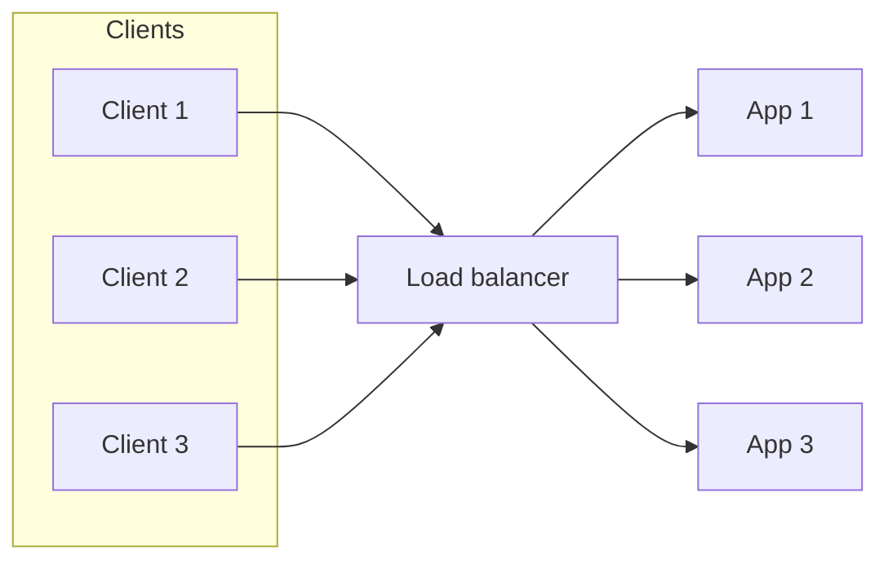
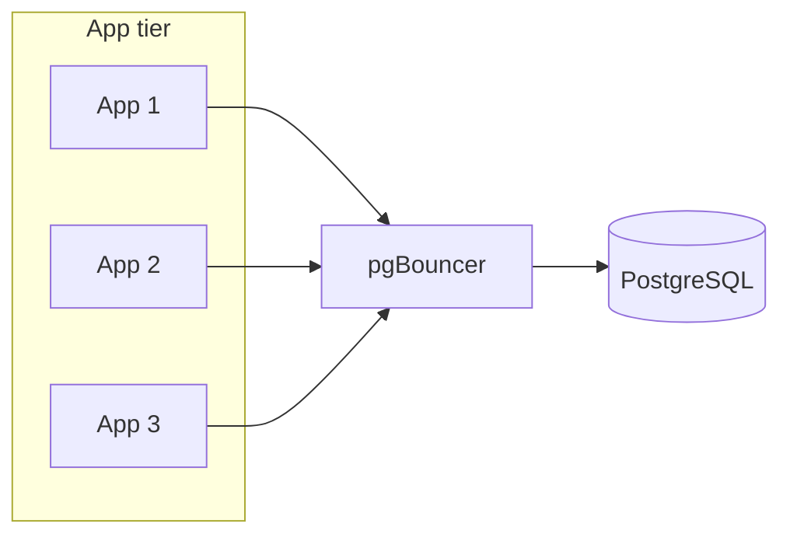
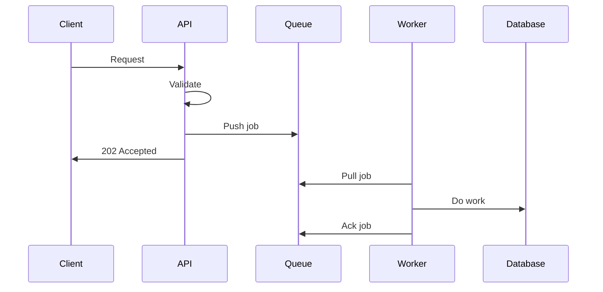

Traffic spiked and the app started to wobble. One server was pegged while others sat underused. Or the database ran out of connections: every new request opened another connection until the limit was hit and everything stalled. Adding more app servers didn't fix it until we put a load balancer in front and fixed how the app talked to the database.

That kind of bottleneck is common. The backend is fine at low load; under growth, the limits show up in uneven load, connection exhaustion, or slow work blocking the request path. This guide is about the operational levers we use: when to scale out versus up, how to spread traffic across instances, how to pool database connections, and how to move heavy work off the request path so the system can handle more load without falling over.


For most web backends, scaling out (more instances) is the first lever: the bottleneck is usually I/O or connection limits, not a single process. Once you have multiple instances, you need something in front to send traffic to all of them.

## Load Balancing: Spreading Traffic Across Instances

A load balancer sits in front of your app instances and decides which instance gets each request. That way no single instance gets overloaded and you can add or remove instances without clients caring.

### Common strategies

**Round-robin** – Send the next request to the next instance in a fixed order. Simple and predictable. Works well when instances are similar and requests are similar in cost. If some requests are much heavier than others, one instance can still end up busier.

**Least connections** – Send the request to the instance with the fewest active connections. Good when requests hold connections for a long time (e.g. WebSockets or long-running HTTP). The balancer needs to track connection counts (or rely on the backend to report load).

**IP hash** – Derive the instance from the client IP (e.g. `hash(IP) % N`). The same client usually hits the same instance, which can help with session affinity or local caches. If a few IPs dominate (e.g. NAT or proxies), load can be uneven.

**Weighted** – Give some instances a higher share of traffic (e.g. newer or bigger boxes get more). Useful when instances are not equal (e.g. during a rollout or when mixing instance sizes).

In practice, start with round-robin or least connections. Use IP hash only if you need sticky behavior and understand the trade-off. Health checks should be enabled so the balancer stops sending traffic to unhealthy instances.



*Figure 1: Load balancer in front of app instances*

### Before and after

With a single app server, all traffic hits one process. If that process or machine dies, the service is down. If traffic grows, you can only scale up (bigger box) until you hit a ceiling.

With a load balancer and multiple app instances, traffic is spread. You can add or remove instances and the balancer distributes work. You need to make sure the app is stateless (or that state is in a shared store) so any instance can serve any request.

## Database Connection Pooling

Many backends open a new database connection per request or per process. Under load, that can exhaust the database's connection limit. The database rejects new connections and the app starts failing. Connection pooling keeps a fixed set of connections open and reuses them, so the app uses far fewer connections than the number of concurrent requests.

### Why pooling matters

Each connection uses memory and a file descriptor on the database server. Databases typically support a limited number of connections (often in the hundreds). If you have many app instances and each opens many connections, you can hit that limit quickly. With a pool, each app process holds a small number of connections (e.g. 10–20) and multiplexes many requests over them. The database sees a stable, predictable number of connections.

### Using pgBouncer for PostgreSQL

pgBouncer is a lightweight connection pooler that sits between your app and PostgreSQL. The app connects to pgBouncer; pgBouncer keeps a pool of real connections to Postgres and assigns them to client connections as needed. You can run it on the same host as the app or on a dedicated host.

Typical settings:
- **Pool mode** – Transaction mode is common: a connection is assigned to a client for the duration of a transaction, then returned to the pool. That gives good utilization. Session mode holds the connection for the whole client session (needed if you use prepared statements or session-level state).
- **Pool size** – How many connections pgBouncer keeps open to Postgres. Should be at or below the database's `max_connections`. Total connections from all app instances to pgBouncer can be much higher; pgBouncer multiplexes them onto the pool.
- **Connection limits per user/database** – So one consumer can't grab the whole pool.

Example config (simplified):

```ini
[databases]
mydb = host=localhost port=5432 dbname=mydb

[pgbouncer]
listen_addr = *
listen_port = 6432
auth_type = md5
pool_mode = transaction
max_client_conn = 1000
default_pool_size = 50
```

The app then connects to port 6432 (pgBouncer) instead of 5432 (Postgres). No code change beyond the connection string in most cases.



*Figure 2: Connection pooling with pgBouncer*

### Application-side pooling

Many drivers (e.g. for PostgreSQL, MySQL) support connection pooling in the app process: a pool of connections is created and reused for requests. That helps within one process but doesn't reduce the total number of connections from many processes to the database. For that you need a proxy like pgBouncer (or the database's built-in pooling if available). Use both: a small per-process pool in the app and pgBouncer (or equivalent) in front of the database so total connections stay under control.

## Moving Heavy Work Off the Request Path

If the request does a lot of work (e.g. image processing, sending emails, or calling several external APIs), the request holds the connection and consumes resources until it's done. That limits how many requests you can handle and makes latency spike under load. Moving that work to a background queue and workers lets the request path stay fast: the API enqueues a job and returns quickly; a worker does the work asynchronously.

### Pattern: queue and workers

A queue (Redis, RabbitMQ, SQS, or similar) holds jobs. The API pushes a job to the queue and responds to the client. One or more worker processes pull jobs from the queue and execute them. If the worker crashes, the job can be retried or re-queued. The request path stays thin: validate input, enqueue job, return.

Use this for:
- Sending email or notifications
- Calling slow or unreliable external APIs
- Generating reports or exports
- Any work that doesn't need to be done before the response

Keep on the request path:
- Reads and writes that the client needs in the response
- Auth and validation
- Fast, simple logic



*Figure 3: Async work via queue and worker*

### Making it reliable

Workers should acknowledge (or remove) a job only after the work is done and persisted. If the worker dies before ack, the queue can redeliver the job. Design work to be idempotent where possible so retries don't cause duplicate side effects. Set timeouts and retry limits so bad jobs don't block the queue forever; use a dead-letter queue or log for manual inspection.

## Performance: Queries and Caching at a High Level

Scaling the number of instances and fixing connections gets you only so far if each request does slow or redundant work.

**Query optimization** – Slow queries show up under load. Use the database's explain tool (e.g. `EXPLAIN ANALYZE` in PostgreSQL) to see where time goes. Add indexes that match the queries you run; avoid over-indexing so writes don't suffer. Fix N+1 patterns (one query per item in a list) by batching or joining so you do one or a few queries per request.

**Caching** – If the same data is read often and can be stale for a short time, cache it (in-process, Redis, or a CDN for public data). That reduces database load and shortens response time. Invalidate or set TTLs so users don't see stale data for too long. Caching is a separate topic; the point here is that scaling out and pooling connections work better when each request does less work and hits the database less often.

## Putting It Together

A practical scaling path often looks like this:

1. **Identify the bottleneck** – CPU, memory, database connections, or I/O. Add basic metrics (CPU, request rate, error rate, database connection count) so you know what's under pressure.
2. **Scale out** – Add app instances and put a load balancer in front. Use round-robin or least connections and health checks.
3. **Pool database connections** – Introduce pgBouncer (or equivalent) and cap per-app connection pool size so the database never sees more connections than it can handle.
4. **Offload heavy work** – Move non-critical work to a queue and workers so the request path stays fast and failures in that work don't take down the API.
5. **Tighten the loop** – Optimize hot queries and add caching where it helps. Then measure again and repeat.

You don't need to do everything at once. Start where the pain is: if connections are exhausting, fix pooling first; if one server is hot, add a load balancer and more instances; if requests are slow because of heavy work, introduce a queue.

## Common Pitfalls

- **No health checks** – The load balancer keeps sending traffic to a dead or stuck instance. Always configure health checks and remove unhealthy instances from the pool.
- **Treating the DB connection limit as infinite** – Each process opens many connections and the database hits `max_connections`. Use a pooler and limit per-process pool size.
- **Doing too much in the request** – Long-running or external calls in the request path increase latency and resource use. Move them to workers.
- **Sticky sessions without a need** – IP hash or cookie-based affinity can cause uneven load. Use it only when you need it (e.g. stateful protocol or local cache), and design for rebalancing when instances change.
- **Scaling without measuring** – Adding servers or connections without knowing the bottleneck can waste cost or hide the real limit. Instrument first, then scale.

## Summary

- **Scale out** when you're I/O-bound and can run multiple stateless instances; **scale up** when one process is CPU- or memory-bound.
- Use a **load balancer** (round-robin or least connections, with health checks) to spread traffic across instances.
- Use **connection pooling** (e.g. pgBouncer for PostgreSQL) so the app doesn't exhaust database connections; size the pool to stay under the database limit.
- **Offload heavy work** to a queue and workers so the request path stays fast and resilient.
- **Optimize queries** and add **caching** where it reduces load and latency; then measure and iterate.

Once traffic grows, the usual sequence is: add instances and a load balancer, fix connection pooling, move slow work to the background, and then optimize the remaining request path. That sequence gets most backends through the next stage of growth without a rewrite.
