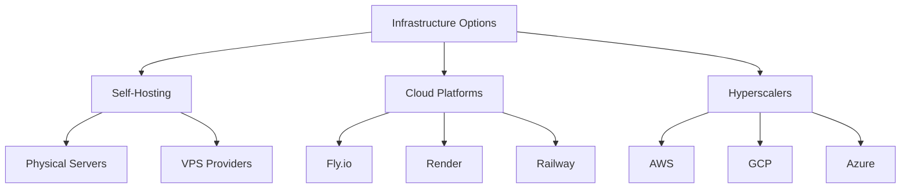
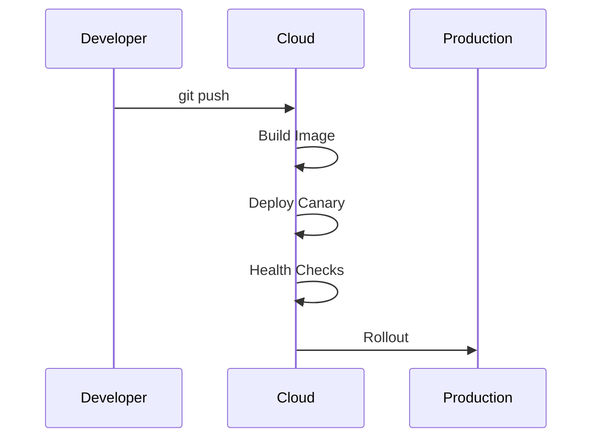

## Introduction

As an indie developer building a technical blog or SaaS product, infrastructure decisions can make or break your project. This deep dive compares:

1. **Traditional Self-Hosting** (bare metal/VPS)
2. **Modern Cloud Platforms** (Fly.io, Render, etc.)
3. **Hyperscalers** (AWS, GCP, Azure)

## 1. Operational Complexity

Self-Hosting Maintenance Checklist

<pre class="cgr7g c2bb0 ca9r6 cx6ng c9xwx cme8e cmy5q"><code class="c4j9y"># Sample health check script for self-hosted setup
import requests
import smtplib

def check_services():
    services = [
        {"name": "Postgres", "port": 5432},
        {"name": "Redis", "port": 6379},
        {"name": "Web", "port": 80}
    ]
    
    for service in services:
        try:
            r = requests.get(f"http://localhost:{service['port']}/health")
            assert r.status_code == 200
        except:
            send_alert(f"{service['name']} down!")

def send_alert(message):
    # Implement SMS/email alerting
    pass
</code></pre>

### Cloud Platform Advantages

*   **Built-in orchestration** (zero-downtime deploys)
*   **Managed databases** (automatic backups)
*   **Global DNS** (Let's Encrypt automation)

## 2. Security Considerations

Self-Hosting Hardening Steps

<pre class="cgr7g c2bb0 ca9r6 cx6ng c9xwx cme8e cmy5q"><code class="c4j9y"># Sample secure Nginx configuration
server {
    listen 443 ssl http2;
    ssl_certificate /path/to/cert.pem;
    ssl_certificate_key /path/to/key.pem;
    
    add_header X-Frame-Options DENY;
    add_header X-Content-Type-Options nosniff;
    add_header Content-Security-Policy "default-src 'self'";
    
    location / {
        proxy_pass http://localhost:3000;
        proxy_set_header X-Real-IP $remote_addr;
    }
}
</code></pre>

### Cloud Platform Security Features

<table class="security-features">
  <thead>
    <tr>
      <th>Provider</th>
      <th>Automatic TLS</th>
      <th>DDoS Protection</th>
      <th>Secret Management</th>
    </tr>
  </thead>
  <tbody>
    <tr>
      <td>Fly.io</td>
      <td>✅</td>
      <td>Basic</td>
      <td>Environment vars</td>
    </tr>
    <tr>
      <td>Render</td>
      <td>✅</td>
      <td>❌</td>
      <td>Web UI</td>
    </tr>
    <tr>
      <td>AWS</td>
      <td>✅</td>
      <td>Advanced</td>
      <td>Secrets Manager</td>
    </tr>
  </tbody>
</table>

## 3. Cost Structures Compared

### Self-Hosting Cost Example (DigitalOcean Droplet)

<pre class="cgr7g c2bb0 ca9r6 cx6ng c9xwx cme8e cmy5q"><code class="c4j9y"># Monthly costs for a basic VPS
- $6/mo  (1vCPU, 1GB RAM, 25GB SSD)
- $1/mo  (Backups)
- $3/mo  (Basic Monitoring)
---------
$10/mo  Total
</code></pre>

### Cloud Platform Example (Fly.io)

<pre class="cgr7g c2bb0 ca9r6 cx6ng c9xwx cme8e cmy5q"><code class="c4j9y"># fly.toml configuration
app = "my-blog"
primary_region = "iad"

[http_service]
  internal_port = 8080
  force_https = true

[[vm]]
  memory = "1gb"
  cpus = 1
</code></pre>

Cost estimate: ~$15-20/month with persistent storage

<table class="!tw-table-auto">
  <thead>
    <tr>
      <th>Factor</th>
      <th>Self-Hosted</th>
      <th>Cloud Platform</th>
      <th>Hyperscaler</th>
    </tr>
  </thead>
  <tbody>
    <tr>
      <td>Base Cost</td>
      <td>$</td>
      <td>$$</td>
      <td>$$$</td>
    </tr>
    <tr>
      <td>Scaling Cost</td>
      <td>Linear</td>
      <td>Non-linear</td>
      <td>Complex</td>
    </tr>
    <tr>
      <td>Bandwidth</td>
      <td>Often free</td>
      <td>Metered</td>
      <td>Expensive</td>
    </tr>
    <tr>
      <td>Storage</td>
      <td>Predictable</td>
      <td>Tiered</td>
      <td>Complex</td>
    </tr>
  </tbody>
</table>

## When to Choose Each Option

### Choose Self-Hosting When:

*   You need predictable long-term costs
*   You have specialized hardware needs
*   Compliance requires physical control

### Choose Cloud Platforms When:

*   You want to focus on code, not infra
*   You need easy global deployment
*   Your traffic is spiky

### Choose Hyperscalers When:

*   You need 50+ microservices
*   You require advanced ML/AI services
*   Your team has cloud expertise

## 4. Hybrid Approach Example

<pre class="cgr7g c2bb0 ca9r6 cx6ng c9xwx cme8e cmy5q"><code class="c4j9y"># Architecture using both Fly.io and a VPS
Web Frontend (Fly.io) → 
    API Service (Fly.io) → 
        Database (Self-hosted VPS with pgBouncer)
</code></pre>

### Benefits:

*   Global edge network for static assets
*   Control over sensitive data storage
*   Cost savings on high-memory workloads

## In Conclusion
For most indie developers, modern cloud platforms offer the best balance:

*   Fly.io for global reach
*   Render for simplicity
*   Railway for rapid prototyping

Reserve self-hosting for:

*   Specialized workloads
*   Cost-sensitive stable applications
*   Learning experiences