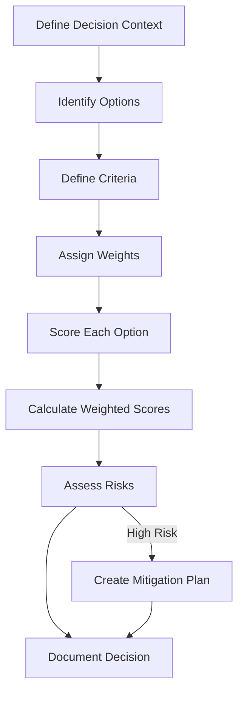
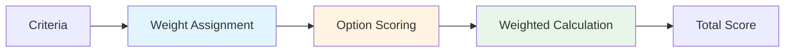
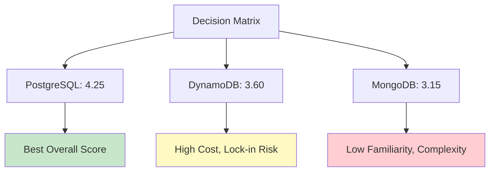
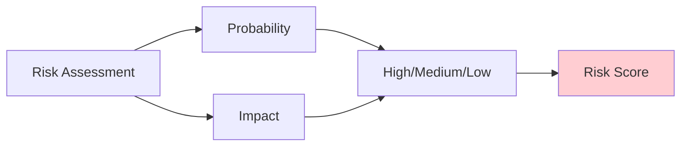

When a client asked us to choose between microservices and a monolith for their new platform, we didn't guess. We used a structured decision framework that evaluated 12 criteria across cost, complexity, performance, and maintainability.

After making 50+ architecture decisions across production systems, I've seen teams waste months on wrong choices because they lacked a systematic approach. Here's the framework that's helped us make better decisions faster.

## The Problem: Why Technical Decisions Fail

Most teams make architecture decisions based on:
- **Latest trends** - "Everyone's using microservices, so we should too"
- **Personal preferences** - "I like this technology"
- **Incomplete analysis** - "It seems faster" without measuring
- **Missing trade-offs** - Focusing on one benefit while ignoring costs

We've seen projects delayed by 6+ months because teams chose the wrong database, architecture pattern, or infrastructure approach. The cost isn't just time, it's technical debt that compounds over years.

Here's how to make decisions systematically.

## The Decision Framework: Criteria → Weights → Scoring

*Figure 1: Decision-Making Process Flow*

---

## Step 1: Define Decision Context

Before evaluating options, clearly define what you're solving.

### Pattern: Decision Statement Template

Use this structure to document your decision context:

**Decision:** Choose [technology/pattern] for [use case]

**Context:**
- **Current state:** [What exists now]
- **Requirements:** [What must be achieved]
- **Constraints:** [Budget, timeline, team skills]
- **Success criteria:** [How we'll measure success]

**Stakeholders:** [Who needs to be involved]  
**Timeline:** [When decision must be made]

### Example: Database Selection

**Decision:** Choose database for user analytics platform

**Context:**
- **Current state:** PostgreSQL handling 10K queries/day
- **Requirements:** Support 1M+ queries/day, real-time analytics
- **Constraints:** $5K/month budget, 3-person team, 6-month timeline
- **Success criteria:** <100ms query latency, 99.9% uptime

**Stakeholders:** Engineering lead, CTO, DevOps  
**Timeline:** Decision needed in 2 weeks

**Why this matters:**
- Prevents scope creep
- Aligns stakeholders on the problem
- Sets clear success metrics
- Documents constraints upfront

---

## Step 2: Identify Evaluation Criteria

Not all criteria are equal. Define what matters for this specific decision.

### Common Criteria Categories

**Performance:**
- Latency (response time)
- Throughput (requests/second)
- Scalability (growth capacity)

**Operational:**
- Setup complexity
- Maintenance overhead
- Monitoring and observability
- Deployment ease

**Cost:**
- Initial cost (licensing, setup)
- Operational cost (hosting, maintenance)
- Team cost (learning curve, hiring)

**Risk:**
- Vendor lock-in
- Technology maturity
- Community support
- Migration difficulty

**Example: Database Selection Criteria**

<pre class="cgr7g c2bb0 ca9r6 cx6ng c9xwx cme8e cmy5q"><code class="c4j9y">criteria = {
    "query_performance": {
        "description": "Average query latency for common operations",
        "category": "performance",
        "measurement": "milliseconds"
    },
    "scalability": {
        "description": "Ability to handle 10x growth",
        "category": "performance",
        "measurement": "qualitative (1-5 scale)"
    },
    "operational_complexity": {
        "description": "Effort required for setup, maintenance, monitoring",
        "category": "operational",
        "measurement": "qualitative (1-5 scale)"
    },
    "monthly_cost": {
        "description": "Total monthly operational cost",
        "category": "cost",
        "measurement": "dollars"
    },
    "vendor_lock_in": {
        "description": "Risk of being locked into specific vendor",
        "category": "risk",
        "measurement": "qualitative (1-5 scale, 5 = high lock-in)"
    },
    "team_familiarity": {
        "description": "Team's existing knowledge and experience",
        "category": "operational",
        "measurement": "qualitative (1-5 scale)"
    }
}
</code></pre>

**Key principles:**
- Include 6-12 criteria (too few = incomplete, too many = analysis paralysis)
- Mix quantitative and qualitative measures
- Focus on criteria that differentiate options
- Document how you'll measure each criterion

---

## Step 3: Assign Weights

Not all criteria are equally important. Weight them based on your context.

### Pattern: Weighted Scoring Matrix

*Figure 2: Weighted Scoring Process*

**Example: Database Selection Weights**

<pre class="cgr7g c2bb0 ca9r6 cx6ng c9xwx cme8e cmy5q"><code class="c4j9y">weights = {
    "query_performance": 0.25,  # Critical for user experience
    "scalability": 0.20,         # Must handle growth
    "operational_complexity": 0.15,  # Small team, limited DevOps
    "monthly_cost": 0.15,        # Budget constraint
    "vendor_lock_in": 0.15,      # Want flexibility
    "team_familiarity": 0.10     # Nice to have, not critical
}

# Verify weights sum to 1.0
assert sum(weights.values()) == 1.0
</code></pre>

**Weighting guidelines:**
- Critical criteria: 0.20-0.30
- Important criteria: 0.10-0.20
- Nice-to-have: 0.05-0.10
- Always sum to 1.0
- Adjust based on your constraints (budget-constrained? Weight cost higher)

---

## Step 4: Score Each Option

Score each option against all criteria using consistent scales.

### Pattern: Scoring Scale

**Quantitative criteria (performance, cost):**
- Use actual measurements when possible
- Normalize to 0-5 scale for comparison

**Qualitative criteria (complexity, risk):**
- Use 1-5 scale: 1 = poor, 3 = acceptable, 5 = excellent
- Document scoring rationale

**Example: Database Comparison**

<pre class="cgr7g c2bb0 ca9r6 cx6ng c9xwx cme8e cmy5q"><code class="c4j9y">options = {
    "PostgreSQL": {
        "query_performance": 4,  # 50ms avg latency (excellent)
        "scalability": 4,        # Handles 10x with read replicas
        "operational_complexity": 3,  # Team knows it, moderate setup
        "monthly_cost": 5,       # $200/month (very low)
        "vendor_lock_in": 5,     # Open source, no lock-in
        "team_familiarity": 5    # Team has 3+ years experience
    },
    "MongoDB": {
        "query_performance": 3,  # 80ms avg latency (good)
        "scalability": 5,        # Excellent horizontal scaling
        "operational_complexity": 2,  # New to team, complex setup
        "monthly_cost": 3,        # $800/month (moderate)
        "vendor_lock_in": 3,     # Some lock-in, but manageable
        "team_familiarity": 2    # Team has minimal experience
    },
    "DynamoDB": {
        "query_performance": 5,   # 20ms avg latency (excellent)
        "scalability": 5,        # Auto-scales seamlessly
        "operational_complexity": 5,  # Fully managed, minimal ops
        "monthly_cost": 2,       # $2000/month (high)
        "vendor_lock_in": 1,     # Strong AWS lock-in
        "team_familiarity": 3    # Some team experience
    }
}
</code></pre>

**Scoring best practices:**
- Score all options in one session (consistency)
- Document assumptions and measurements
- Use benchmarks when available (don't guess performance)
- Get team input (reduces bias)

---

## Step 5: Calculate Weighted Scores

Multiply scores by weights and sum for each option.

### Pattern: Weighted Score Calculation

<pre class="cgr7g c2bb0 ca9r6 cx6ng c9xwx cme8e cmy5q"><code class="c4j9y">def calculate_weighted_score(option_scores, weights):
    """Calculate total weighted score for an option."""
    total = 0
    for criterion, score in option_scores.items():
        total += score * weights[criterion]
    return total

# Calculate scores
results = {}
for option_name, scores in options.items():
    results[option_name] = calculate_weighted_score(scores, weights)

# Results:
# PostgreSQL: 4.25
# MongoDB: 3.15
# DynamoDB: 3.60
</code></pre>

**Decision matrix visualization:**

*Figure 3: Weighted Score Comparison*

**Key insight:** The highest score isn't always the best choice. You need to assess risks next.

---

## Step 6: Risk Assessment

High-scoring options can have deal-breaking risks. Assess them separately.

### Pattern: Risk Matrix

*Figure 4: Risk Assessment Framework*

**Risk categories:**

**Technical Risk:**
- Technology maturity (new vs. established)
- Performance at scale (untested)
- Integration complexity

**Operational Risk:**
- Team expertise gaps
- Maintenance burden
- Vendor support quality

**Business Risk:**
- Vendor lock-in
- Cost escalation
- Migration difficulty

**Example: Risk Assessment for Database Options**

<pre class="cgr7g c2bb0 ca9r6 cx6ng c9xwx cme8e cmy5q"><code class="c4j9y">risks = {
    "PostgreSQL": {
        "vendor_lock_in": {"probability": "low", "impact": "low", "score": 1},
        "scaling_limits": {"probability": "medium", "impact": "medium", "score": 6},
        "team_capacity": {"probability": "low", "impact": "low", "score": 1}
    },
    "MongoDB": {
        "vendor_lock_in": {"probability": "medium", "impact": "medium", "score": 6},
        "learning_curve": {"probability": "high", "impact": "high", "score": 9},
        "operational_complexity": {"probability": "high", "impact": "medium", "score": 8}
    },
    "DynamoDB": {
        "vendor_lock_in": {"probability": "high", "impact": "high", "score": 9},
        "cost_escalation": {"probability": "high", "impact": "high", "score": 9},
        "migration_difficulty": {"probability": "high", "impact": "high", "score": 9}
    }
}

# Risk scoring: probability (1-3) × impact (1-3) = score (1-9)
# High risk: 7-9, Medium: 4-6, Low: 1-3
</code></pre>

**Risk mitigation strategies:**

<pre class="cgr7g c2bb0 ca9r6 cx6ng c9xwx cme8e cmy5q"><code class="c4j9y">mitigation_plans = {
    "PostgreSQL": {
        "scaling_limits": "Plan: Implement read replicas at 500K queries/day. Cost: $400/month. Timeline: 2 weeks."
    },
    "DynamoDB": {
        "vendor_lock_in": "Plan: Use abstraction layer (repository pattern). Allows migration to PostgreSQL later. Effort: 1 week.",
        "cost_escalation": "Plan: Set up cost alerts at $1500/month. Review usage monthly. Budget buffer: 20%."
    }
}
</code></pre>

**Decision rule:** If an option has a high-risk score (7-9) without a clear mitigation plan, consider it a deal-breaker.

---

## Step 7: Make the Decision

Combine weighted scores with risk assessment.

### Pattern: Decision Matrix

<pre class="cgr7g c2bb0 ca9r6 cx6ng c9xwx cme8e cmy5q"><code class="c4j9y">def make_decision(results, risks, mitigation_plans):
    """Final decision based on scores and risks."""
    
    # Sort by weighted score
    sorted_options = sorted(results.items(), key=lambda x: x[1], reverse=True)
    
    for option, score in sorted_options:
        option_risks = risks[option]
        high_risks = [r for r in option_risks.values() if r["score"] &gt;= 7]
        
        if high_risks and not mitigation_plans.get(option):
            print(f"{option}: High risk without mitigation")
            continue
        
        if high_risks:
            print(f"{option}: Score {score:.2f}, risks mitigated")
        else:
            print(f"{option}: Score {score:.2f}, low risk")
        
        return option  # Return best viable option

# Result: PostgreSQL (best score, manageable risks)
</code></pre>

**Decision framework:**

1. **If top option has low risk:** Choose it
2. **If top option has high risk:**
   - Can you mitigate it? → Choose with mitigation plan
   - Can't mitigate? → Consider second-best option
3. **If scores are close (<0.5 difference):** Choose lower-risk option

**Example decision:**

**Decision:** PostgreSQL

**Rationale:**
- Highest weighted score (4.25)
- Low risk profile (only medium risk: scaling limits)
- Scaling risk mitigated with read replicas plan
- Team familiarity reduces operational risk
- Cost-effective for current scale

**Mitigation plan:**
- Monitor query volume weekly
- Implement read replicas when approaching 500K queries/day
- Budget: $400/month for scaling

---

## Step 8: Document the Decision

Documentation prevents "why did we choose this?" questions later.

### Pattern: Architecture Decision Record (ADR)

Use this template to document your architecture decisions:

**ADR-001: Database Selection for Analytics Platform**

**Status:** Accepted

**Context:**
[Decision context from Step 1]

**Decision:**
PostgreSQL with read replica scaling strategy

**Rationale:**
- Weighted score: 4.25 (highest)
- Risk assessment: Low overall risk
- Team familiarity reduces learning curve
- Cost-effective at current scale ($200/month)

**Alternatives Considered:**
- MongoDB: Lower score (3.15), high learning curve risk
- DynamoDB: Good score (3.60), but high vendor lock-in and cost risk

**Consequences:**
- **Positive:** Fast implementation (team expertise)
- **Positive:** Low operational overhead
- **Negative:** Will need read replicas at scale (planned)

**Mitigation Plans:**
- Scaling: Read replicas at 500K queries/day
- Monitoring: Query performance dashboard
- Budget: $400/month scaling budget approved

**Review Date:** 6 months (or when reaching 400K queries/day)

**Why documentation matters:**
- Prevents rehashing decisions
- Explains context to new team members
- Enables informed revisiting when context changes
- Creates organizational knowledge

---

## Real-World Example: Microservices vs. Monolith

Let's apply this framework to a common decision.

**Decision Context:**
- Building new e-commerce platform
- Team: 8 engineers, 6-month timeline
- Expected traffic: 10K users/day initially, 100K in 12 months

**Criteria and Weights:**

<pre class="cgr7g c2bb0 ca9r6 cx6ng c9xwx cme8e cmy5q"><code class="c4j9y">criteria_weights = {
    "development_speed": 0.25,      # Critical for 6-month timeline
    "operational_complexity": 0.20,  # Small team, limited DevOps
    "scalability": 0.15,            # Must handle 10x growth
    "team_expertise": 0.15,         # Team knows monoliths better
    "cost": 0.10,                   # Budget conscious
    "future_flexibility": 0.15      # Want to evolve architecture
}
</code></pre>

**Scoring:**

<pre class="cgr7g c2bb0 ca9r6 cx6ng c9xwx cme8e cmy5q"><code class="c4j9y">options = {
    "Monolith": {
        "development_speed": 5,        # Faster initial development
        "operational_complexity": 5,  # Single deploy, simpler ops
        "scalability": 3,            # Vertical scaling, then horizontal
        "team_expertise": 5,         # Team has 5+ years experience
        "cost": 5,                    # Lower infrastructure cost
        "future_flexibility": 2       # Harder to split later
    },
    "Microservices": {
        "development_speed": 2,       # Slower due to coordination
        "operational_complexity": 2,  # Multiple services, complex ops
        "scalability": 5,            # Excellent horizontal scaling
        "team_expertise": 2,         # Team has minimal experience
        "cost": 3,                    # Higher infrastructure overhead
        "future_flexibility": 5      # Easy to evolve independently
    }
}

# Weighted scores:
# Monolith: 4.30
# Microservices: 2.90
</code></pre>

**Risk Assessment:**

<pre class="cgr7g c2bb0 ca9r6 cx6ng c9xwx cme8e cmy5q"><code class="c4j9y">risks = {
    "Monolith": {
        "scaling_bottleneck": {"probability": "medium", "impact": "medium", "score": 6},
        "team_coordination": {"probability": "low", "impact": "low", "score": 1}
    },
    "Microservices": {
        "operational_overhead": {"probability": "high", "impact": "high", "score": 9},
        "team_learning_curve": {"probability": "high", "impact": "high", "score": 9},
        "coordination_complexity": {"probability": "high", "impact": "medium", "score": 8}
    }
}
</code></pre>

**Decision:** Monolith

**Rationale:**
- Higher score (4.30 vs 2.90)
- Lower risk profile
- Aligns with team expertise and timeline
- Scaling risk mitigated: Plan to extract services when needed (strangler pattern)

**Mitigation:** 
- Design with service boundaries in mind (bounded contexts)
- Use modular architecture (clean architecture, domain-driven design)
- Extract services when scaling needs arise (not prematurely)

---

## Common Mistakes to Avoid

**1. Analysis Paralysis**
- Don't evaluate 10+ options. Limit to 3-5 viable options.
- Set a time limit for analysis (1-2 weeks max).

**2. Ignoring Constraints**
- Don't choose the "best" technology if your team can't operate it.
- Factor in budget, timeline, and team skills.

**3. Overweighting Latest Trends**
- New doesn't mean better for your context.
- Prefer proven technologies unless you have a specific need.

**4. Skipping Risk Assessment**
- High-scoring options can have deal-breaking risks.
- Always assess risks separately from scores.

**5. Poor Documentation**
- Decisions without documentation get rehashed.
- Document context, rationale, and alternatives.

---

## When to Revisit Decisions

Decisions aren't permanent. Revisit when:

**Context Changes:**
- Team size doubles (operational complexity changes)
- Traffic grows 10x (scalability becomes critical)
- Budget increases significantly (cost constraints relax)

**Technology Evolves:**
- New options emerge that weren't available
- Current choice shows limitations at scale
- Better alternatives mature

**Timeline:**
- Review major decisions annually
- Review when hitting scaling milestones
- Review when constraints change significantly

---

## Conclusion

Technical decisions shape your system's future. A structured framework helps you:

- **Evaluate options systematically** - No more guessing
- **Assess trade-offs clearly** - Understand what you're giving up
- **Mitigate risks proactively** - Plan for problems before they happen
- **Document rationale** - Prevent rehashing decisions

The framework isn't about finding the "perfect" choice—it's about making the best decision given your constraints, risks, and context.

**Next steps:**
1. Use this framework for your next architecture decision
2. Document it as an ADR
3. Review decisions when context changes
4. Share the framework with your team

Remember: A good decision made quickly beats a perfect decision made too late.
