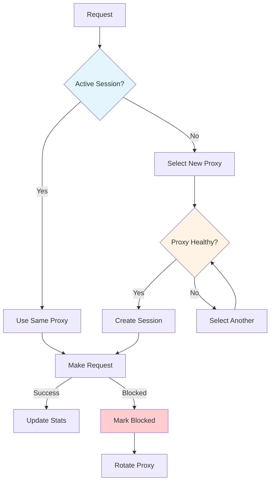
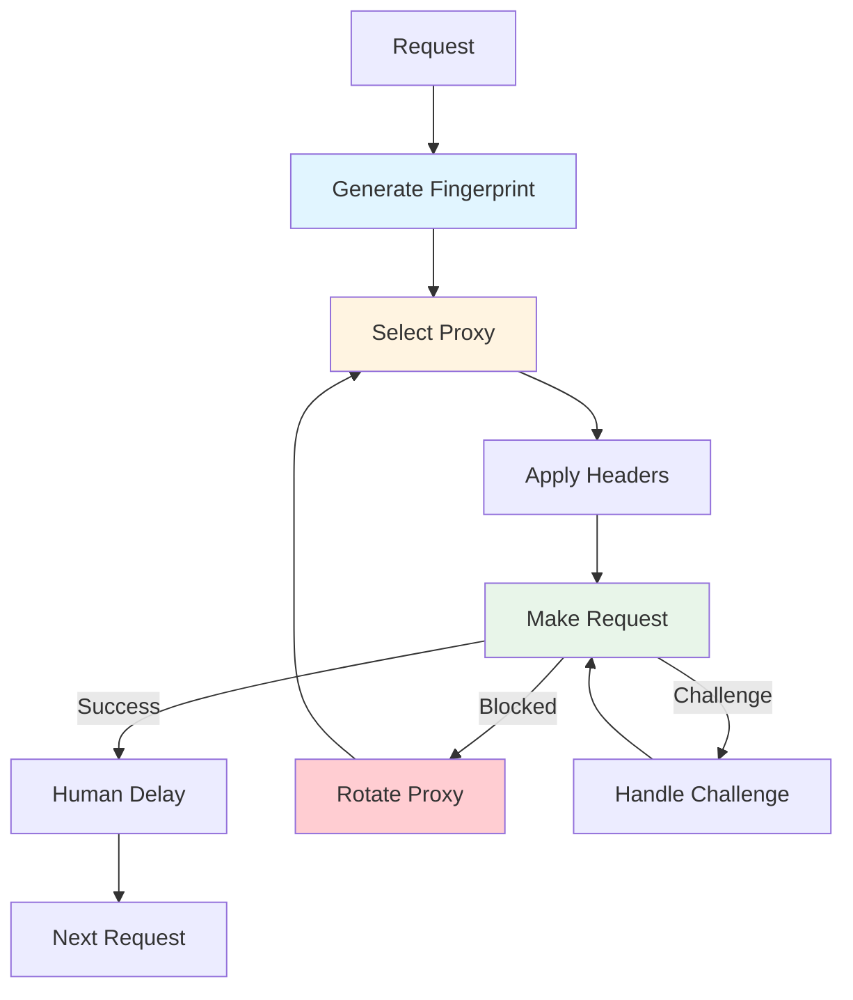

A price monitoring scraper processing 50,000 product pages daily started getting 403 errors after two weeks. The scraping logic was solid. The problem? Every request used the same User-Agent, fixed 2-second delays, and AWS datacenter IPs. The anti-bot system flagged it immediately.

After building 100+ production scrapers that process millions of pages, I've learned that anti-detection isn't about tricks. It's about mimicking real browser behavior consistently. Here are the techniques that actually work.

## The Problem: Why Scrapers Get Detected

Most scrapers get blocked because they exhibit bot-like behavior:

- **Identical headers** - Same User-Agent for every request
- **Predictable timing** - Fixed delays between requests
- **Datacenter IPs** - All requests from cloud provider IPs
- **Missing browser signals** - No JavaScript execution, missing headers
- **Suspicious patterns** - Requests too fast, too regular, or at odd hours

Modern anti-bot systems (Cloudflare, PerimeterX, DataDome) detect these patterns. Here's how to avoid them.

## Technique 1: Realistic Browser Fingerprints

Browser fingerprinting identifies browsers by their unique combination of headers, JavaScript properties, and network characteristics. Your scraper needs realistic fingerprints.

### Understanding Browser Fingerprints

A browser fingerprint consists of:
- **User-Agent string** - Browser, OS, version
- **Accept headers** - Content types, languages, encodings
- **Connection headers** - Keep-alive, upgrade preferences
- **Security headers** - TLS version, cipher suites
- **Screen properties** - Resolution, color depth (from JavaScript)

### Pattern: Realistic Header Rotation

<pre class="cgr7g c2bb0 ca9r6 cx6ng c9xwx cme8e cmy5q"><code class="c4j9y">import random
from typing import Dict

class BrowserFingerprint:
    """Generate realistic browser fingerprints for scraping."""
    
    # Real User-Agents from actual browsers (updated regularly)
    USER_AGENTS = [
        'Mozilla/5.0 (Windows NT 10.0; Win64; x64) AppleWebKit/537.36 (KHTML, like Gecko) Chrome/120.0.0.0 Safari/537.36',
        'Mozilla/5.0 (Macintosh; Intel Mac OS X 10_15_7) AppleWebKit/537.36 (KHTML, like Gecko) Chrome/120.0.0.0 Safari/537.36',
        'Mozilla/5.0 (Windows NT 10.0; Win64; x64; rv:121.0) Gecko/20100101 Firefox/121.0',
        'Mozilla/5.0 (Macintosh; Intel Mac OS X 10_15_7) AppleWebKit/605.1.15 (KHTML, like Gecko) Version/17.1 Safari/605.1.15',
        'Mozilla/5.0 (X11; Linux x86_64) AppleWebKit/537.36 (KHTML, like Gecko) Chrome/120.0.0.0 Safari/537.36'
    ]
    
    def generate_headers(self) -&gt; Dict[str, str]:
        """Generate realistic browser headers matching the User-Agent."""
        user_agent = random.choice(self.USER_AGENTS)
        
        # Headers must match User-Agent (Chrome vs Firefox have different headers)
        if 'Chrome' in user_agent:
            headers = {
                'User-Agent': user_agent,
                'Accept': 'text/html,application/xhtml+xml,application/xml;q=0.9,image/avif,image/webp,image/apng,*/*;q=0.8',
                'Accept-Language': 'en-US,en;q=0.9',
                'Accept-Encoding': 'gzip, deflate, br',
                'Connection': 'keep-alive',
                'Upgrade-Insecure-Requests': '1',
                'Sec-Fetch-Dest': 'document',
                'Sec-Fetch-Mode': 'navigate',
                'Sec-Fetch-Site': 'none',
                'Sec-Fetch-User': '?1',
                'Cache-Control': 'max-age=0'
            }
        elif 'Firefox' in user_agent:
            headers = {
                'User-Agent': user_agent,
                'Accept': 'text/html,application/xhtml+xml,application/xml;q=0.9,*/*;q=0.8',
                'Accept-Language': 'en-US,en;q=0.5',
                'Accept-Encoding': 'gzip, deflate, br',
                'Connection': 'keep-alive',
                'Upgrade-Insecure-Requests': '1',
                'DNT': '1'
            }
        else:  # Safari
            headers = {
                'User-Agent': user_agent,
                'Accept': 'text/html,application/xhtml+xml,application/xml;q=0.9,*/*;q=0.8',
                'Accept-Language': 'en-US,en;q=0.9',
                'Accept-Encoding': 'gzip, deflate, br',
                'Connection': 'keep-alive'
            }
        
        return headers
</code></pre>

### Key Principles

**1. Header Consistency**
- Headers must match the User-Agent (Chrome headers with Chrome UA, Firefox with Firefox)
- Include all standard headers a real browser sends
- Use realistic Accept-Language values (match common locales)

**2. Rotate Realistically**
- Don't rotate headers on every request (real browsers don't change)
- Use the same fingerprint for a session (10-50 requests)
- Rotate between sessions, not within sessions

**3. Keep User-Agents Updated**
- Update User-Agent strings quarterly (browsers update frequently)
- Use real User-Agents from actual browsers, not made-up ones
- Match User-Agent to OS (Windows UA on Windows IPs)

---

## Technique 2: Proxy Management and Rotation

Proxies are essential for avoiding IP-based blocking. The key is using the right type and rotation pattern.

### Proxy Types: Residential vs Datacenter

**Residential Proxies:**
- Real home IP addresses
- Harder to detect (look like real users)
- More expensive ($50-200/GB)
- Slower (higher latency)
- Use for: High-value targets, strict anti-bot systems

**Datacenter Proxies:**
- Cloud provider IPs (AWS, GCP, Azure)
- Cheaper ($5-20/GB)
- Faster (lower latency)
- Easier to detect
- Use for: High-volume scraping, less strict sites

**Mobile Proxies:**
- Real mobile carrier IPs
- Most expensive ($100-300/GB)
- Best for mobile-specific sites
- Use for: Mobile apps, mobile-optimized sites

### Pattern: Intelligent Proxy Rotation

<pre class="cgr7g c2bb0 ca9r6 cx6ng c9xwx cme8e cmy5q"><code class="c4j9y">from typing import List, Optional
from collections import defaultdict
import time

class ProxyManager:
    """Manages proxy rotation with session persistence and health tracking."""
    
    def __init__(self, proxies: List[str], session_duration: int = 300):
        # Format: 'http://user:pass@ip:port' or 'socks5://user:pass@ip:port'
        self.proxies = proxies
        self.session_duration = session_duration  # Seconds
        self.current_sessions = {}  # {proxy: session_start_time}
        self.proxy_stats = defaultdict(lambda: {'success': 0, 'failed': 0, 'blocked': 0})
        self.blocked_proxies = set()
    
    def get_proxy(self, domain: str) -&gt; Optional[str]:
        """Get proxy for domain, maintaining session persistence."""
        # Check if we have an active session for this domain
        if domain in self.current_sessions:
            proxy, session_start = self.current_sessions[domain]
            
            # Check if session is still valid
            if time.time() - session_start &lt; self.session_duration:
                if proxy not in self.blocked_proxies:
                    return proxy
        
        # Get new proxy (exclude blocked ones)
        available_proxies = [p for p in self.proxies if p not in self.blocked_proxies]
        
        if not available_proxies:
            return None
        
        proxy = random.choice(available_proxies)
        self.current_sessions[domain] = (proxy, time.time())
        return proxy
    
    def mark_blocked(self, proxy: str):
        """Mark proxy as blocked (temporarily or permanently)."""
        self.blocked_proxies.add(proxy)
        self.proxy_stats[proxy]['blocked'] += 1
        
        # Remove from active sessions
        self.current_sessions = {
            domain: (p, start) 
            for domain, (p, start) in self.current_sessions.items()
            if p != proxy
        }
</code></pre>

### Proxy Rotation Strategy

*Figure 1: Proxy Rotation Flow*

**Key principles:**
- **Session persistence**: Use same proxy for a domain for 5-10 minutes (like real browsers)
- **Health tracking**: Monitor success/failure rates per proxy
- **Automatic rotation**: Rotate on 429/403 errors, not on every request
- **Geographic matching**: Use proxies from same country as target site

---

## Technique 3: Human-Like Request Timing

Fixed delays are a dead giveaway. Real users have variable timing patterns.

### Pattern: Realistic Delay Distribution

<pre class="cgr7g c2bb0 ca9r6 cx6ng c9xwx cme8e cmy5q"><code class="c4j9y">import random
import time
import numpy as np

class HumanDelay:
    """Generate human-like delays between requests."""
    
    def __init__(self, base_delay: float = 2.0):
        # Base delay in seconds (average time between page views)
        self.base_delay = base_delay
    
    def get_delay(self) -&gt; float:
        """Generate delay using log-normal distribution (matches human behavior)."""
        # Log-normal distribution: most delays are short, some are long
        # This matches real user behavior (quick clicks, occasional pauses)
        log_mean = np.log(self.base_delay)
        log_std = 0.5  # Variance in log space
        
        delay = np.random.lognormal(log_mean, log_std)
        
        # Cap delays (no delays longer than 30 seconds)
        return min(delay, 30.0)
    
    def wait(self):
        """Wait for human-like delay."""
        delay = self.get_delay()
        time.sleep(delay)

# Usage in scraper
delay = HumanDelay(base_delay=3.0)

for url in urls:
    response = requests.get(url, headers=headers)
    # Process response...
    delay.wait()  # Human-like delay
</code></pre>

### Timing Patterns by Scenario

**Browsing behavior:**
- **Fast browsing**: 1-3 seconds between pages (user scanning quickly)
- **Normal browsing**: 3-8 seconds (reading content)
- **Slow browsing**: 8-15 seconds (deep reading)

**Pattern variations:**
- Add occasional longer pauses (30-60 seconds) - user got distracted
- Vary delays based on page type (product pages longer than list pages)
- Respect robots.txt crawl-delay if specified

---

## Technique 4: Browser Fingerprinting Avoidance

Modern sites use JavaScript to fingerprint browsers. Your scraper needs to handle this.

### Common Fingerprinting Techniques

**1. Canvas Fingerprinting**
- Renders text to canvas, extracts pixel data
- Unique per browser/OS combination

**2. WebGL Fingerprinting**
- GPU-specific rendering differences

**3. Audio Context Fingerprinting**
- Audio processing differences

**4. Font Detection**
- Available system fonts

**5. Screen Properties**
- Resolution, color depth, pixel ratio

### Pattern: Using Headless Browsers (Selenium/Playwright)

<pre class="cgr7g c2bb0 ca9r6 cx6ng c9xwx cme8e cmy5q"><code class="c4j9y">from selenium import webdriver
from selenium.webdriver.chrome.options import Options
from selenium.webdriver.common.by import By

class StealthBrowser:
    """Configure browser to avoid fingerprinting."""
    
    def create_driver(self, proxy: str = None):
        options = Options()
        
        # Headless mode (but can be detected)
        # options.add_argument('--headless')  # Comment out if detection is an issue
        
        # Remove automation flags
        options.add_experimental_option("excludeSwitches", ["enable-automation"])
        options.add_experimental_option('useAutomationExtension', False)
        
        # Realistic window size
        options.add_argument('--window-size=1920,1080')
        
        # User-Agent (must match real browser)
        options.add_argument('--user-agent=Mozilla/5.0 (Windows NT 10.0; Win64; x64) AppleWebKit/537.36 (KHTML, like Gecko) Chrome/120.0.0.0 Safari/537.36')
        
        # Proxy
        if proxy:
            options.add_argument(f'--proxy-server={proxy}')
        
        # Disable features that reveal automation
        options.add_argument('--disable-blink-features=AutomationControlled')
        
        driver = webdriver.Chrome(options=options)
        
        # Execute script to remove webdriver property
        driver.execute_cdp_cmd('Page.addScriptToEvaluateOnNewDocument', {
            'source': '''
                Object.defineProperty(navigator, 'webdriver', {
                    get: () => undefined
                });
            '''
        })
        
        return driver
</code></pre>

### When to Use Headless Browsers

**Use Selenium/Playwright when:**
- Site requires JavaScript execution
- Heavy fingerprinting detection
- Dynamic content loading
- Complex authentication flows

**Use requests/Scrapy when:**
- Static HTML content
- Simple sites without JavaScript
- High-volume scraping (browsers are slower)
- Cost-sensitive projects

---

## Technique 5: Cloudflare and Anti-Bot Bypass

Cloudflare and similar services use challenge-response systems (CAPTCHA, JavaScript challenges). Here's how to handle them.

### Understanding Cloudflare Challenges

**Types of challenges:**
1. **JavaScript challenge** - Requires solving a challenge in browser
2. **CAPTCHA** - Image-based challenge
3. **Rate limiting** - Temporary blocks after too many requests
4. **Browser check** - Verifies browser capabilities

### Pattern: Using Cloudflare Bypass Libraries

<pre class="cgr7g c2bb0 ca9r6 cx6ng c9xwx cme8e cmy5q"><code class="c4j9y"># Using cloudscraper library (handles Cloudflare challenges)
import cloudscraper

class CloudflareBypass:
    """Handle Cloudflare challenges automatically."""
    
    def __init__(self):
        # cloudscraper mimics browser behavior to bypass challenges
        self.session = cloudscraper.create_scraper(
            browser={
                'browser': 'chrome',
                'platform': 'windows',
                'desktop': True
            }
        )
    
    def get(self, url: str, headers: dict = None):
        """Make request, automatically handling Cloudflare challenges."""
        try:
            response = self.session.get(url, headers=headers, timeout=30)
            
            # Check if we got a challenge page
            if 'challenge-platform' in response.text or 'cf-browser-verification' in response.text:
                # Wait and retry (cloudscraper handles this, but we can add custom logic)
                time.sleep(5)
                response = self.session.get(url, headers=headers)
            
            return response
        except Exception as e:
            logger.error(f"Cloudflare bypass failed: {e}")
            raise
</code></pre>

### Alternative: Using Playwright with Stealth Plugins

<pre class="cgr7g c2bb0 ca9r6 cx6ng c9xwx cme8e cmy5q"><code class="c4j9y"># Using playwright-stealth for better bypass
from playwright.sync_api import sync_playwright
from playwright_stealth import stealth_sync

def scrape_with_playwright(url: str, proxy: str = None):
    with sync_playwright() as p:
        browser = p.chromium.launch(
            headless=False,  # Headless can be detected
            proxy={"server": proxy} if proxy else None
        )
        
        context = browser.new_context(
            user_agent='Mozilla/5.0 (Windows NT 10.0; Win64; x64) AppleWebKit/537.36 (KHTML, like Gecko) Chrome/120.0.0.0 Safari/537.36',
            viewport={'width': 1920, 'height': 1080}
        )
        
        page = context.new_page()
        
        # Apply stealth techniques
        stealth_sync(page)
        
        # Navigate and wait for content
        page.goto(url, wait_until='networkidle')
        
        # Get page content
        content = page.content()
        
        browser.close()
        return content
</code></pre>

**Important notes:**
- Cloudflare bypass is an arms race (techniques change frequently)
- Some challenges require manual solving (CAPTCHA)
- Consider using CAPTCHA solving services for production (2Captcha, AntiCaptcha)
- Rate limiting: Respect rate limits to avoid challenges

---

## Combining Techniques: Complete Anti-Detection System

Here's how these techniques work together:

*Figure 2: Complete Anti-Detection Flow*

### Implementation in Scrapy

<pre class="cgr7g c2bb0 ca9r6 cx6ng c9xwx cme8e cmy5q"><code class="c4j9y"># Scrapy middleware combining all techniques
from scrapy import Spider
from scrapy.http import Request
import random
import time

class AntiDetectionMiddleware:
    def __init__(self, proxy_manager, fingerprint_generator, delay_manager):
        self.proxy_manager = proxy_manager
        self.fingerprint_generator = fingerprint_generator
        self.delay_manager = delay_manager
    
    def process_request(self, request: Request, spider: Spider):
        """Apply anti-detection techniques to request."""
        # Get domain for session persistence
        domain = request.url.split('/')[2]
        
        # Get proxy for this domain
        proxy = self.proxy_manager.get_proxy(domain)
        if proxy:
            request.meta['proxy'] = proxy
        
        # Generate realistic headers
        headers = self.fingerprint_generator.generate_headers()
        for key, value in headers.items():
            request.headers[key] = value
        
        # Add human delay
        delay = self.delay_manager.get_delay()
        request.meta['download_delay'] = delay
        
        return None  # Continue processing
    
    def process_response(self, request: Request, response, spider: Spider):
        """Handle blocked responses."""
        # Check for blocking indicators
        if response.status in [403, 429]:
            proxy = request.meta.get('proxy')
            if proxy:
                self.proxy_manager.mark_blocked(proxy)
        
        return response
</code></pre>

---

## Common Mistakes to Avoid

**1. Over-Rotating Headers**
- Don't change User-Agent on every request
- Real browsers keep same headers for a session
- Rotate between sessions, not within

**2. Fixed Delays**
- Fixed delays are easily detected
- Use variable delays with realistic distribution
- Add occasional longer pauses

**3. Ignoring Proxy Health**
- Don't keep using blocked proxies
- Track success rates per proxy
- Rotate away from failing proxies

**4. Missing Browser Signals**
- Include all standard headers
- Match headers to User-Agent type
- Don't skip optional but common headers

**5. Too Aggressive Scraping**
- Respect rate limits
- Don't scrape faster than humans would
- Add delays between requests

---

## Real-World Results

We've implemented these techniques for clients scraping:

- **E-commerce sites**: 100K+ products/day, <1% block rate
- **Real estate listings**: 50K listings/day, residential proxies
- **Job boards**: 200K posts/day, datacenter proxies with rotation

**Common improvements:**
- Block rate: 50% → <1% (with proper techniques)
- Success rate: 60% → 99%+
- Cost: Reduced by 40% (better proxy management)
- Detection time: Immediate → Weeks (realistic fingerprints)

---

## When to Use Each Technique

**Basic sites (no anti-bot):**
- Realistic headers
- Variable delays
- No proxies needed

**Moderate protection:**
- Headers + delays
- Datacenter proxies
- Session persistence

**Heavy protection (Cloudflare, etc.):**
- All techniques
- Residential proxies
- Headless browsers (Selenium/Playwright)
- Cloudflare bypass libraries

**Enterprise-grade protection:**
- All techniques
- Mobile proxies
- CAPTCHA solving services
- Distributed scraping (multiple IPs)

---

## Conclusion

Anti-detection isn't about tricks. It's about mimicking real browser behavior consistently:

- **Realistic fingerprints** - Headers that match real browsers
- **Smart proxy rotation** - Session persistence, health tracking
- **Human-like timing** - Variable delays, realistic patterns
- **Browser fingerprinting avoidance** - Use headless browsers when needed
- **Challenge handling** - Cloudflare bypass libraries, CAPTCHA solving

The techniques above have been tested across 100+ production scrapers processing millions of pages. Start with headers and delays, add proxies as needed, and use browsers only when necessary.

**Next steps:**
1. Implement realistic header rotation
2. Add variable delays between requests
3. Integrate proxy management for high-volume scraping
4. Monitor block rates and adjust techniques
5. Use headless browsers only when JavaScript is required

Remember: The best anti-detection is looking like a real user, not avoiding detection.
